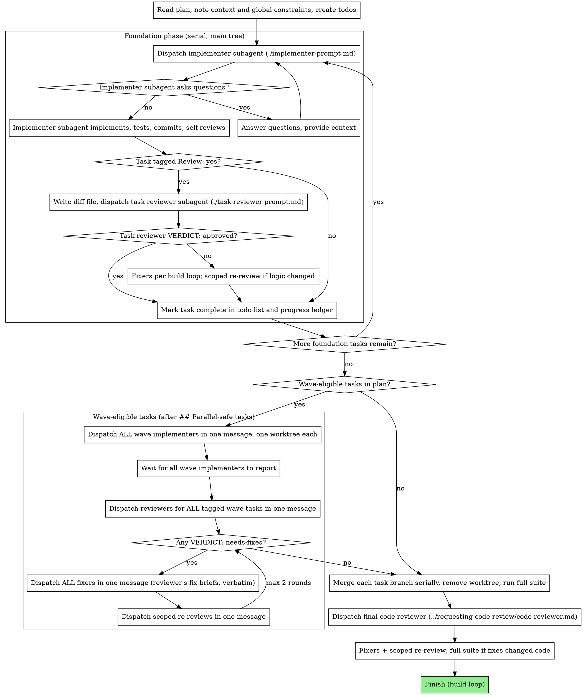

# superpowers-fast Tiered Workflow Implementation Plan

> **For agentic workers:** REQUIRED SUB-SKILL: Use superpowers:subagent-driven-development (recommended) or superpowers:executing-plans to implement this plan task-by-task. Steps use checkbox (`- [ ]`) syntax for tracking.

**Goal:** Turn this fork into `superpowers-fast`: size every task (Simple / Medium / Large), route each tier to a right-sized flow sharing one build/test/review loop, trim and cut what the tiers make redundant, and add tooling to measure the result.

**Architecture:** The session bootstrap (`using-superpowers-fast`) sizes and routes. A shared reference (`skills/using-superpowers-fast/references/build-loop.md`) holds pre-flight, the loop, the right-first-time checklist, Finish, and worktree rules; `quick-change` (Simple), `lean-build` (Medium), and `subagent-driven-development` (Large) point at it instead of repeating it. The plugin is renamed everywhere; paths written into user repos keep `docs/superpowers/` and `.superpowers/`.

**Tech Stack:** Markdown skills, bash hooks and tests, JSON manifests (Claude Code, Cursor, Codex, OpenCode), a Node OpenCode plugin, Python 3.12 stdlib scripts.

**Spec:** `docs/superpowers/specs/2026-09-11-fast-tiers-design.md` · reference texts in `docs/superpowers/specs/2026-09-11-fast-tiers-reference/`

## Global Constraints

- Plugin name `superpowers-fast`; skill namespace `superpowers-fast:*`; bootstrap skill `using-superpowers-fast`.
- New skills: `quick-change` (Simple), `lean-build` (Medium). Shared loop: `skills/using-superpowers-fast/references/build-loop.md`.
- Paths written into user repos keep the old name: `docs/superpowers/specs|plans`, `.superpowers/`.
- Plugin text names model tiers only — cheap / standard / most capable — never vendor model names.
- Concision standard: cut pure duplication and anything the tiers overrule; keep every specific instruction, tightened. Skill texts in this plan are final — transcribe them exactly.
- Tier announcement format: `Sizing as <Tier>: <reason>. Say "<other tier>" or "<other tier>" to override.`
- Harnesses kept: Claude Code, Cursor, Codex, OpenCode. Version `1.0.0` in every manifest. Repo `https://github.com/sampocs/superpowers-fast`.
- Python follows `~/.claude/AGENTS.md` conventions: module imports for functions, full type annotations, dataclasses over wide tuples, `StrEnum` for compared strings, named arguments, guard clauses, comments that say why.
- `shellcheck` is not installed here; check shell scripts with `bash -n`.

## Execution notes

- Tasks 1–3 are foundation, in order. Tasks 4–10 depend only on 1–3. Tasks 11–12 run after all branches merge; the controller executes them.
- `Review:` tags mark tasks whose risk warrants a per-task review under the new flow. This plan is executed with the currently installed SDD, which reviews every task; follow the user's instruction on which applies.
- Task 7's find-and-replace blocks are written against the tree **after** Task 2 (namespace already `superpowers-fast:`).

---

### Task 1: Cut dropped skills, harnesses, and upstream tooling

**Files:**
- Delete: `skills/executing-plans/`, `skills/dispatching-parallel-agents/`, `skills/using-git-worktrees/`, `skills/finishing-a-development-branch/`, `skills/brainstorming/spec-document-reviewer-prompt.md`, `skills/writing-plans/plan-document-reviewer-prompt.md`, `skills/using-superpowers/references/pi-tools.md`, `skills/using-superpowers/references/antigravity-tools.md`, `.pi/`, `.kimi-plugin/`, `gemini-extension.json`, `GEMINI.md`, `docs/README.kimi.md`, `docs/porting-to-a-new-harness.md`, `tests/pi/`, `tests/kimi/`, `tests/antigravity/`, `tests/codex-plugin-sync/`, `tests/codex/test-package-codex-plugin.sh`, `tests/claude-code/test-worktree-native-preference.sh`, `tests/claude-code/test-worktree-path-policy.sh`, `scripts/package-codex-plugin.sh`, `scripts/sync-to-codex-plugin.sh`, `.github/`, `.pre-commit-config.yaml`
- Modify: `.version-bump.json`, `tests/claude-code/run-skill-tests.sh`, `tests/claude-code/README.md`, `tests/claude-code/test-subagent-driven-development.sh`

**Interfaces:**
- Produces: a tree without the cut skills or harnesses. References to cut skills remain in `subagent-driven-development`, `writing-plans`, `using-superpowers`, and `codex-tools.md` until Tasks 3 and 7 rewrite them.
- Review: no

- [ ] **Step 1: Delete the cut files**

```bash
git rm -r -q \
  skills/executing-plans skills/dispatching-parallel-agents \
  skills/using-git-worktrees skills/finishing-a-development-branch \
  skills/brainstorming/spec-document-reviewer-prompt.md \
  skills/writing-plans/plan-document-reviewer-prompt.md \
  skills/using-superpowers/references/pi-tools.md \
  skills/using-superpowers/references/antigravity-tools.md \
  .pi .kimi-plugin gemini-extension.json GEMINI.md \
  docs/README.kimi.md docs/porting-to-a-new-harness.md \
  tests/pi tests/kimi tests/antigravity tests/codex-plugin-sync \
  tests/codex/test-package-codex-plugin.sh \
  tests/claude-code/test-worktree-native-preference.sh \
  tests/claude-code/test-worktree-path-policy.sh \
  scripts/package-codex-plugin.sh scripts/sync-to-codex-plugin.sh \
  .github .pre-commit-config.yaml
```

- [ ] **Step 2: Replace `.version-bump.json`**

```json
{
  "files": [
    { "path": "package.json", "field": "version" },
    { "path": ".claude-plugin/plugin.json", "field": "version" },
    { "path": ".cursor-plugin/plugin.json", "field": "version" },
    { "path": ".codex-plugin/plugin.json", "field": "version" },
    { "path": ".claude-plugin/marketplace.json", "field": "plugins.0.version" }
  ],
  "audit": {
    "exclude": [
      "CHANGELOG.md",
      "RELEASE-NOTES.md",
      "node_modules",
      ".git",
      ".version-bump.json",
      "scripts/bump-version.sh"
    ]
  }
}
```

- [ ] **Step 3: Drop test references to the deleted worktree tests and skill**

In `tests/claude-code/run-skill-tests.sh`, delete the line:
```
    "test-worktree-path-policy.sh"
```

In `tests/claude-code/README.md`, delete this section (and the blank line after it):
```
#### test-worktree-native-preference.sh
RED-GREEN-REFACTOR validation for the using-git-worktrees skill (~5 minutes):
- RED: skill without Step 1a — agent should use `git worktree add`
- GREEN: skill with Step 1a — agent should use the native EnterWorktree tool
- PRESSURE: same as GREEN under urgency framing with pre-existing `.worktrees/`
- Drill scenario `worktree-creation-under-pressure.yaml` covers the PRESSURE phase only
```

In `tests/claude-code/test-subagent-driven-development.sh`, replace `"using-git-worktrees\|worktree"` with `"worktree"`.

- [ ] **Step 4: Verify the remaining plugin tests still pass**

Run: `bash tests/hooks/test-session-start.sh && bash tests/codex/test-marketplace-manifest.sh && bash -n tests/claude-code/run-skill-tests.sh`
Expected: both suites end in PASS lines; no FAIL; no syntax errors.

Run: `git grep -n -e "executing-plans" -e "dispatching-parallel-agents" -e "using-git-worktrees" -e "finishing-a-development-branch" -- skills hooks tests`
Expected: matches only in `skills/subagent-driven-development/`, `skills/writing-plans/SKILL.md`, and `skills/using-superpowers/references/codex-tools.md` (rewritten later).

- [ ] **Step 5: Commit**

```bash
git add -A
git commit -m "cut: drop superseded skills, unused harnesses, and upstream tooling"
```

---

### Task 2: Rename the plugin identity to superpowers-fast

**Files:**
- Move: `skills/using-superpowers/` → `skills/using-superpowers-fast/`; `.opencode/plugins/superpowers.js` → `.opencode/plugins/superpowers-fast.js`
- Replace: `package.json`, `.claude-plugin/plugin.json`, `.claude-plugin/marketplace.json`, `.cursor-plugin/plugin.json`, `.codex-plugin/plugin.json`, `.agents/plugins/marketplace.json`
- Modify: `hooks/session-start`, `.opencode/plugins/superpowers-fast.js`, `tests/codex/test-marketplace-manifest.sh`, `tests/opencode/*`, every `superpowers:` namespace reference under `skills/` and `tests/`

**Interfaces:**
- Produces: skill namespace `superpowers-fast:*`; bootstrap path `skills/using-superpowers-fast/SKILL.md`; OpenCode entry `.opencode/plugins/superpowers-fast.js`; Codex dev marketplace `superpowers-fast-dev`.
- Review: yes (install-critical manifests)

- [ ] **Step 1: Move the bootstrap skill and the OpenCode plugin**

```bash
git mv skills/using-superpowers skills/using-superpowers-fast
git mv .opencode/plugins/superpowers.js .opencode/plugins/superpowers-fast.js
perl -pi -e 's/^name: using-superpowers$/name: using-superpowers-fast/' skills/using-superpowers-fast/SKILL.md
```

- [ ] **Step 2: Rename references in code and tests**

```bash
# Skill namespace
git grep -l "superpowers:" -- skills tests hooks | xargs perl -pi -e 's/\bsuperpowers:(?=[a-z])/superpowers-fast:/g'
# Bootstrap skill name
git grep -lE "using-superpowers([^-]|$)" -- skills tests hooks .opencode | xargs perl -pi -e 's/using-superpowers(?!-fast)/using-superpowers-fast/g'
# Hook and OpenCode bootstrap wording
perl -pi -e 's/You have superpowers\./You have superpowers-fast./; s/hook for superpowers plugin/hook for superpowers-fast plugin/' hooks/session-start
perl -pi -e 's/^You have superpowers\.$/You have superpowers-fast./' .opencode/plugins/superpowers-fast.js
# OpenCode test harness paths
perl -pi -e 's{plugins/superpowers\.js}{plugins/superpowers-fast.js}g; s{(\$OPENCODE_CONFIG_DIR/superpowers)(?!-fast)}{$1-fast}g' tests/opencode/*.sh
# Codex marketplace test expectations
perl -pi -e 's/"superpowers-dev"/"superpowers-fast-dev"/; s/"Superpowers Dev"/"Superpowers Fast Dev"/; s/== "superpowers"\]/== "superpowers-fast"]/; s/"superpowers plugin entry count"/"superpowers-fast plugin entry count"/' tests/codex/test-marketplace-manifest.sh
```

- [ ] **Step 3: Replace `package.json`**

```json
{
  "name": "superpowers-fast",
  "version": "1.0.0",
  "description": "Tiered skills workflow and runtime bootstrap for coding agents",
  "type": "module",
  "main": ".opencode/plugins/superpowers-fast.js",
  "keywords": [
    "skills",
    "workflow",
    "debugging",
    "code-review"
  ]
}
```

- [ ] **Step 4: Replace `.claude-plugin/plugin.json`**

```json
{
  "name": "superpowers-fast",
  "description": "Tiered skills workflow for coding agents: sizes each task (simple / medium / large) and scales brainstorming, planning, review, and testing to fit",
  "version": "1.0.0",
  "author": {
    "name": "Sam Pochyly",
    "email": "sam@stridelabs.co"
  },
  "homepage": "https://github.com/sampocs/superpowers-fast",
  "repository": "https://github.com/sampocs/superpowers-fast",
  "license": "MIT",
  "keywords": ["skills", "workflow", "brainstorming", "debugging", "code-review", "tdd"]
}
```

- [ ] **Step 5: Replace `.claude-plugin/marketplace.json`**

```json
{
  "name": "superpowers-fast",
  "description": "Marketplace for superpowers-fast, a tiered fork of the Superpowers skills library",
  "owner": {
    "name": "Sam Pochyly",
    "email": "sam@stridelabs.co"
  },
  "plugins": [
    {
      "name": "superpowers-fast",
      "description": "Tiered skills workflow: sizes each task and scales brainstorming, planning, review, and testing to fit",
      "version": "1.0.0",
      "source": "./",
      "author": {
        "name": "Sam Pochyly",
        "email": "sam@stridelabs.co"
      }
    }
  ]
}
```

- [ ] **Step 6: Replace `.cursor-plugin/plugin.json`**

```json
{
  "name": "superpowers-fast",
  "displayName": "Superpowers Fast",
  "description": "Tiered skills workflow: sizes each task and scales brainstorming, planning, review, and testing to fit",
  "version": "1.0.0",
  "author": {
    "name": "Sam Pochyly",
    "email": "sam@stridelabs.co"
  },
  "homepage": "https://github.com/sampocs/superpowers-fast",
  "repository": "https://github.com/sampocs/superpowers-fast",
  "license": "MIT",
  "keywords": ["skills", "workflow", "brainstorming", "debugging", "code-review", "tdd"],
  "skills": "./skills/",
  "hooks": "./hooks/hooks-cursor.json"
}
```

- [ ] **Step 7: Replace `.codex-plugin/plugin.json`** (`"hooks": {}` must stay exactly an empty object — see the comment in `tests/codex/test-marketplace-manifest.sh`)

```json
{
  "name": "superpowers-fast",
  "version": "1.0.0",
  "description": "Tiered skills workflow: sizes each task and scales brainstorming, planning, review, and testing to fit.",
  "author": {
    "name": "Sam Pochyly",
    "email": "sam@stridelabs.co",
    "url": "https://github.com/sampocs"
  },
  "homepage": "https://github.com/sampocs/superpowers-fast",
  "repository": "https://github.com/sampocs/superpowers-fast",
  "license": "MIT",
  "keywords": ["brainstorming", "subagent-driven-development", "skills", "planning", "tdd", "debugging", "code-review", "workflow"],
  "skills": "./skills/",
  "hooks": {},
  "interface": {
    "displayName": "Superpowers Fast",
    "shortDescription": "Tiered planning, review, and testing workflows for coding agents",
    "longDescription": "Sizes every task as simple, medium, or large and routes it to a right-sized flow: a quick change with one review, a brainstorm with a lean build, or a full plan with subagent-driven development.",
    "developerName": "Sam Pochyly",
    "category": "Developer Tools",
    "capabilities": ["Interactive", "Read", "Write"],
    "defaultPrompt": [
      "I've got an idea for something I'd like to build.",
      "Let's add a feature to this project."
    ],
    "websiteURL": "https://github.com/sampocs/superpowers-fast",
    "privacyPolicyURL": "https://docs.github.com/en/site-policy/privacy-policies/github-general-privacy-statement",
    "termsOfServiceURL": "https://docs.github.com/en/site-policy/github-terms/github-terms-of-service",
    "brandColor": "#F59E0B",
    "composerIcon": "./assets/superpowers-small.svg",
    "logo": "./assets/app-icon.png",
    "screenshots": []
  }
}
```

- [ ] **Step 8: Replace `.agents/plugins/marketplace.json`**

```json
{
  "name": "superpowers-fast-dev",
  "interface": {
    "displayName": "Superpowers Fast Dev"
  },
  "plugins": [
    {
      "name": "superpowers-fast",
      "source": {
        "source": "url",
        "url": "./"
      },
      "policy": {
        "installation": "AVAILABLE",
        "authentication": "ON_INSTALL"
      },
      "category": "Developer Tools"
    }
  ]
}
```

- [ ] **Step 9: Verify**

Run: `bash tests/hooks/test-session-start.sh && bash tests/codex/test-marketplace-manifest.sh`
Expected: all PASS; the Codex test prints `Codex marketplace manifest looks good`.

Run: `CLAUDE_PLUGIN_ROOT="$PWD" bash hooks/session-start | grep -o "You have superpowers-fast"`
Expected: `You have superpowers-fast`

Run: `git grep -n "superpowers:" -- skills tests hooks .opencode; git grep -nE "using-superpowers([^-]|$)" -- skills tests hooks .opencode`
Expected: no output.

Run: `node --check .opencode/plugins/superpowers-fast.js && bash tests/opencode/test-plugin-loading.sh`
Expected: syntax OK; plugin-loading PASS lines. If `opencode` is not on PATH for non-interactive shells, report that and continue.

- [ ] **Step 10: Commit**

```bash
git add -A
git commit -m "rename: plugin identity is now superpowers-fast"
```

---

### Task 3: Shared foundation — bootstrap, build loop, final-review prompt

**Files:**
- Replace: `skills/using-superpowers-fast/SKILL.md`, `skills/using-superpowers-fast/references/codex-tools.md`, `skills/requesting-code-review/SKILL.md`, `skills/requesting-code-review/code-reviewer.md`
- Create: `skills/using-superpowers-fast/references/build-loop.md`

**Interfaces:**
- Produces:
  - `build-loop.md` sections other skills cite by name: **Pre-flight**, **The loop**, **Right-first-time checklist**, **Finish**, **Worktrees**.
  - `code-reviewer.md` placeholders `[MODEL]`, `[DESCRIPTION]`, `[PLAN_OR_REQUIREMENTS]`, `[BASE_SHA]`, `[HEAD_SHA]`, `[DIFF_FILE]`, and two dispatch-ready outputs: `## Fix brief (standard tier)` and `## Fix brief (cheap tier)`.
- Depends on: Tasks 1-2
- Review: yes (behavior-shaping core)

- [ ] **Step 1: Replace `skills/using-superpowers-fast/SKILL.md`**

````markdown
---
name: using-superpowers-fast
description: Use when starting any conversation - establishes how to find and use skills, requiring skill invocation before ANY response, and sizes work before building
---

<SUBAGENT-STOP>
If you were dispatched as a subagent to execute a specific task, ignore this skill.
</SUBAGENT-STOP>

<EXTREMELY-IMPORTANT>
If you think there is even a 1% chance a skill might apply to what you are doing, you ABSOLUTELY MUST invoke the skill.

IF A SKILL APPLIES TO YOUR TASK, YOU DO NOT HAVE A CHOICE. YOU MUST USE IT. This is not negotiable.
</EXTREMELY-IMPORTANT>

## The Rule

**Invoke relevant or requested skills BEFORE any response or action** — including clarifying questions, exploring the codebase, or checking files. If it turns out wrong for the situation, you don't have to use it.

Then announce "Using [skill] to [purpose]" and follow the skill exactly.

## Size the work

Before building or changing anything, size the task, announce it in one line naming the other two tiers, and proceed without waiting:

`Sizing as Medium: <reason>. Say "simple" or "large" to override.`

| Tier | Test | Examples | Route |
|---|---|---|---|
| **Simple** | Nothing to decide; you'd do it without asking. | fix a misaligned button · patch a missing null check · add a field to an existing form | `quick-change` |
| **Medium** | A few answers shape the build; fits in 1–3 chunks. | admin page with summary metrics · new endpoint + its UI · retry/backoff for a flaky integration | `brainstorming` → `lean-build` |
| **Large** | New subsystem or cross-cutting change; needs a sequenced plan. | a backtesting engine · new order type across engine, API, UI · swapping auth providers | `brainstorming` → `writing-plans` → `subagent-driven-development` |

- **Bugs with an unknown cause:** `systematic-debugging` first; size the fix once the root cause is known.
- **Risk** (money, auth, state machines) doesn't raise the tier; it strengthens review within it.
- **Tiers can change** mid-task. Re-announce when they do.
- **Before entering plan mode:** size first; Medium or Large → `brainstorming` first.
- Process skills (`brainstorming`, `systematic-debugging`) come before implementation skills (e.g. frontend-design).

## Models

Skills name model tiers: cheap, standard, most capable. Map them with the user's instructions; with no mapping, use the session model for every tier. Always set a model explicitly when dispatching a subagent.

## Red Flags

These thoughts mean STOP — you're rationalizing:

| Thought | Reality |
|---------|---------|
| "This is just a simple question" | Questions are tasks. Check for skills. |
| "I need more context first" | Skill check comes BEFORE clarifying questions. |
| "Let me explore the codebase first" | Skills tell you HOW to explore. Check first. |
| "This doesn't need a formal skill" | If a skill exists, use it. |
| "The skill is overkill" | Simple tasks have `quick-change`. Use it. |
| "I remember this skill" | Skills evolve. Read the current version. |
| "This doesn't count as a task" | Action = task. Check for skills. |
| "I'll just do this one thing first" | Check BEFORE doing anything. |
| "I know what that means" | Knowing the concept ≠ using the skill. Invoke it. |

## Platform Adaptation

Codex: read `references/codex-tools.md`.

## User Instructions

User instructions (CLAUDE.md, AGENTS.md, direct requests) take precedence over skills, which override default behavior. Skip a skill workflow only when your human partner explicitly says to.
````

- [ ] **Step 2: Create `skills/using-superpowers-fast/references/build-loop.md`**

````markdown
# Build Loop

Shared by `quick-change` (Simple), `lean-build` (Medium), and `subagent-driven-development` (Large).

## Pre-flight

About a minute, before writing code:

1. `git fetch`.
2. Look for overlap: `git log --oneline -10 origin/main -- <paths you'll touch>` and, if `gh` is available, `gh pr list --search "<path or keyword>"`. Recent overlap → rebase first. An open PR already doing the work → tell the user before building.
3. Baseline: `gh run list --branch main --limit 3` (or the repo's CI). If `main` is red, note the failing checks in `.superpowers/baseline.md`. Check a later failure against the baseline — and, if unclear, re-run it alone on `origin/main` — before debugging it as yours.
4. Follow the repo's or user's branching policy; never build on `main` directly.

## The loop

```
build — targeted tests as you go
  → full suite; fix until green
  → review
  → fixes; each fixer re-runs the tests covering its change
  → scoped re-review of any fix that touched logic
  → full suite again, only if fixes changed code
  → Finish
```

| | Simple | Medium | Large |
|---|---|---|---|
| **Builds** | main agent | 1–3 lean implementers | SDD tasks, with TDD |
| **Review** | one fresh-eyes reviewer: standard tier; most capable if the diff touches money, auth, or state machines | one final whole-branch review, most capable tier | per-task review on tasks tagged `Review: yes`, plus a final whole-branch review, most capable tier |
| **Fixes** | main agent, inline | Critical/Important → one standard-tier fixer; then Minor → one cheap-tier fixer | same as Medium |

- **Targeted tests** = the tests covering the code you changed. Never the full suite while iterating.
- **Full-suite failures:** check the baseline first. Pre-existing failures are reported, not fixed.
- **Fixers** get their band's complete findings list — never one fixer per finding — plus the covering test commands. Each reports the command it ran and the output.
- **Scoped re-review:** only the fix diffs, only when a fix touched logic, whatever the severity. Fixes that change only comments, tests, or constants skip it.
- **Cap:** at most two fix → re-review rounds. Then stop and tell the user what's left.
- **Bug fixes:** a regression test that fails before the fix.
- A clean review means one full-suite run; a review with fixes means two.

## Right-first-time checklist

Give this to every implementer and fixer; apply it yourself in `quick-change`.

1. Changed behavior → update the comments and docstrings that describe it.
2. Each test must fail if the behavior breaks: assert effects, not calls, substrings, or tautologies; test negative cases with non-default values.
3. Cover every branch, call site, and state transition you touched.
4. Reuse existing constants and helpers; don't redeclare them.

## Finish

1. Push the branch.
2. Open the PR per the repo's policy (AGENTS.md / CLAUDE.md); otherwise `gh pr create` with a summary and the test evidence.
3. Run any repo-specific post-PR steps (e.g. Definition of Done, external review).
4. Remove worktrees in the background.

No merge / keep / discard prompt.

## Worktrees

Use the repo's or user's worktree tool when one is configured (e.g. `git gtr new <branch> --yes`); otherwise `git worktree add`. One worktree per parallel implementer — two agents in one tree race on the git index, even with disjoint files. Create them in one batch and confirm N paths for N implementers before dispatching.
````

- [ ] **Step 3: Replace `skills/using-superpowers-fast/references/codex-tools.md`**

````markdown
## Subagent dispatch requires multi-agent support

Add to your Codex config (`~/.codex/config.toml`):

```toml
[features]
multi_agent = true
```

This enables `spawn_agent`, `wait_agent`, and `close_agent` for `lean-build` and `subagent-driven-development`. Close implementer and reviewer subagents when they finish.

## Bootstrap

Codex discovers skills natively and has no session-start hook. If no tier has been announced, size the task per `using-superpowers-fast` before building.

## Environment Detection

Before creating worktrees or finishing a branch, detect the environment with read-only git commands:

```bash
GIT_DIR=$(cd "$(git rev-parse --git-dir)" 2>/dev/null && pwd -P)
GIT_COMMON=$(cd "$(git rev-parse --git-common-dir)" 2>/dev/null && pwd -P)
BRANCH=$(git branch --show-current)
```

- `GIT_DIR != GIT_COMMON` → already in a linked worktree (skip creation)
- `BRANCH` empty → detached HEAD (cannot branch/push/PR from sandbox)

## Codex App Finishing

When the sandbox blocks branch/push operations (detached HEAD in an externally managed worktree), commit all work and tell the user to use the App's controls:

- **"Create branch"** — names the branch, then commit/push/PR via the App UI
- **"Hand off to local"** — transfers work to the user's local checkout

You can still run tests, stage files, and suggest branch names, commit messages, and PR descriptions.
````

- [ ] **Step 4: Replace `skills/requesting-code-review/SKILL.md`**

````markdown
---
name: requesting-code-review
description: Use when completing tasks, implementing major features, or before merging to verify work meets requirements
---

# Requesting Code Review

Dispatch a reviewer subagent with precisely crafted context — never your session's history — so it judges the work product, not your thought process.

## When

- **In a tier flow:** as the build loop says (`../using-superpowers-fast/references/build-loop.md`): Simple — one fresh-eyes reviewer; Medium — one final whole-branch review; Large — tasks tagged `Review: yes`, plus a final whole-branch review.
- **Ad hoc:** before merging, when stuck, or after fixing a complex bug.

## How

1. Pick the range. Whole branch: `BASE=$(git merge-base origin/main HEAD)`. One task: the commit recorded before it started — never `HEAD~1`, which drops all but the last commit.
2. Package the diff: `../subagent-driven-development/scripts/review-package $BASE HEAD` prints the file it wrote.
3. Dispatch a `general-purpose` subagent with [code-reviewer.md](code-reviewer.md) — most capable tier for whole-branch reviews. Fill in:
   - `[DESCRIPTION]` — what was built
   - `[PLAN_OR_REQUIREMENTS]` — spec or plan path, or the requirements
   - `[BASE_SHA]`, `[HEAD_SHA]` — the range
   - `[DIFF_FILE]` — the path `review-package` printed

## Act on the findings

- **Critical/Important** → one standard-tier fixer with the reviewer's standard-tier fix brief.
- **Minor** → then one cheap-tier fixer with the cheap-tier fix brief.
- **Re-review** only the fix diffs, only when a fix touched logic. At most two rounds, then tell the user what's left.
- **Reviewer wrong?** Push back with technical reasoning and the code or tests that prove it.

## Red Flags

- Skipping review because "it's simple" — Simple still gets one fresh-eyes review.
- Ignoring Critical findings, or proceeding with unfixed Important ones.
- One fixer per finding instead of one per severity band.
- Arguing with valid technical feedback.
````

- [ ] **Step 5: Replace `skills/requesting-code-review/code-reviewer.md`**

````markdown
# Code Reviewer Prompt Template

Use this template to dispatch a whole-branch or ad-hoc reviewer.

```
Subagent (general-purpose):
  description: "Review [scope]"
  model: [MODEL — most capable tier for whole-branch reviews]
  prompt: |
    You are a senior code reviewer. Review completed work against its
    requirements and catch issues before they ship.

    ## What Was Implemented

    [DESCRIPTION]

    ## Requirements / Plan

    [PLAN_OR_REQUIREMENTS]

    ## Diff Under Review

    **Base:** [BASE_SHA] · **Head:** [HEAD_SHA]
    **Diff file:** [DIFF_FILE]

    Read the diff file once: commit list, stat summary, and the full diff with
    context. If it's missing, run `git diff --stat [BASE_SHA]..[HEAD_SHA]` and
    `git diff [BASE_SHA]..[HEAD_SHA]`. Inspect code outside the diff only to
    check a concrete risk you can name, and say what you checked.

    ## Read-Only Review

    Do not mutate the working tree, the index, HEAD, or branch state. Use
    `git show`, `git diff`, `git log`. Need another revision? Check it out into
    a temporary directory (`git worktree add /tmp/review-[SHA] [SHA]`).

    Don't re-run the full suite; the controller already ran it. Run a focused
    test only when the code raises a specific doubt no existing run answers.

    ## What to Check

    - **Requirements:** everything specified is present; deviations are
      justified; nothing unrequested was added.
    - **Correctness:** edge cases, error handling, state transitions, and the
      seams where separately built pieces meet.
    - **Architecture:** separation of concerns, clean integration with the
      surrounding code, security, performance.
    - **Tests:** they verify real behavior, not mocks, and would fail if the
      behavior broke; changed branches and call sites are covered.
    - **Production readiness:** migrations, backward compatibility, stale
      comments or docs.

    ## Calibration

    Categorize by actual severity. Critical: bugs, security holes, data loss,
    broken functionality. Important: fragile behavior, missed requirements,
    test gaps on real behavior, maintainability damage you'd block a merge
    over. Minor: polish. Acknowledge what was done well. If the plan itself is
    wrong, say so.

    ## Output Format

    ### Strengths
    [Specific.]

    ### Issues
    #### Critical (Must Fix)
    #### Important (Should Fix)
    #### Minor (Nice to Have)

    For each: file:line, what's wrong, why it matters, how to fix if not obvious.

    ### Assessment
    **Ready to merge?** Yes | No | With fixes
    **Reasoning:** 1-2 sentences.

    ## Fix briefs (dispatched verbatim — include whichever apply)

        ## Fix brief (standard tier)
        You are fixing Critical/Important review findings in <project>.
        Findings (fix ALL):
        1. (<severity>) <file>:<line> — <what is wrong, what correct looks like>
        Covering tests: run <exact commands> and confirm they pass.
        Right-first-time: update comments/docstrings you invalidate; tests must
        fail if the behavior breaks; cover every branch you touch; reuse
        existing constants and helpers.
        Return only: STATUS, commit hash, test command and result.

        ## Fix brief (cheap tier)
        You are fixing Minor review findings in <project>.
        Findings (fix ALL):
        1. <file>:<line> — <what to change>
        Covering tests: run <exact commands> and confirm they pass.
        Return only: STATUS, commit hash, test command and result.

    A fix brief that says "see findings above" is a defect — the fixer sees
    only the brief.
```

**Placeholders:** `[MODEL]`, `[DESCRIPTION]`, `[PLAN_OR_REQUIREMENTS]`, `[BASE_SHA]`, `[HEAD_SHA]`, `[DIFF_FILE]` (the path `review-package` prints).
````

- [ ] **Step 6: Verify**

Run: `CLAUDE_PLUGIN_ROOT="$PWD" bash hooks/session-start | grep -c "Sizing as Medium"`
Expected: `1` — the new bootstrap is injected.

Run: `bash tests/hooks/test-session-start.sh`
Expected: all PASS.

Run: `git grep -n -e "dispatching-parallel-agents" -e "using-git-worktrees" -e "finishing-a-development-branch" -e GEMINI -- skills/using-superpowers-fast skills/requesting-code-review`
Expected: no output.

- [ ] **Step 7: Commit**

```bash
git add -A
git commit -m "feat: tier sizing bootstrap, shared build loop, and final-review prompt"
```

---

## Parallel-safe tasks

### Task 4: `quick-change` skill (Simple tier)

**Files:**
- Create: `skills/quick-change/SKILL.md`

**Interfaces:**
- Consumes: `build-loop.md` sections Pre-flight, The loop, Right-first-time checklist, Finish.
- Produces: skill `quick-change`, the Simple-tier entry named by the bootstrap.
- Depends on: Tasks 1-3
- Review: yes (behavior-shaping)

- [ ] **Step 1: Create `skills/quick-change/SKILL.md`**

````markdown
---
name: quick-change
description: Use for Simple-tier changes - one clear fix or feature, nothing to decide, a handful of files and up to ~150 lines of logic. Align, do, prove, one fresh-eyes review; ejects to Medium when the work stops being small.
---

# Quick Change

The Simple tier: align on intent, make the change, prove it, get one fresh-eyes review. No spec, no plan, no implementer subagents.

**Tier check.** If no tier was announced, size the task per `using-superpowers-fast` first. Anything that isn't Simple → `brainstorming`.

Agents already "know" to align and verify; under momentum they skip both. This skill makes them non-optional and evidence-bearing. Keep the teeth.

## Use when ALL hold

- One clear fix or feature; you can name it in one sentence without hedging.
- No design choice with more than one reasonable answer.
- A handful of files, up to ~150 lines of logic.

**Below the floor** (typo, rename, comment-only): just do it — no review — but still prove anything provable.

## 1. Align (before any code)

One short message: **what** you'll change, **which files**, and **the single assumption most likely to be wrong**.

- Low-stakes assumption → proceed in the same turn; the user can interrupt.
- Load-bearing (wrong means redoing the work) → ask that one question first. Usually there are zero questions.

Never skip the one-liner.

## 2. Pre-flight

Per `../using-superpowers-fast/references/build-loop.md`. Follow the repo's or user's branching policy; never commit to `main` directly.

## 3. Do

- Follow existing patterns. Small diff, in scope — "while I'm here" changes are a tripwire.
- Apply the right-first-time checklist (build-loop.md).
- Comments are production-grade: sparse, *why* not *what*, matching the file's density. Delete anything that narrates the edit ("now also handles X"). Test: would it make sense to a cold reader a year from now?
- **Prove it:** run the targeted test or exercise the change and read the real output. Bug fix → a regression test that fails before the fix. No runtime surface (docs, config) → say so and show the diff reads correctly.

## 4. The loop

Run the build loop from the full suite on, Simple column. The reviewer is one fresh-eyes subagent that gets the diff and the one-sentence task, nothing else:

> Read this diff cold. What interaction or code path could be wrong that a happy-path test wouldn't catch? Report Critical / Important / Minor with file:line.

Standard tier; most capable if the diff touches money, auth, or state machines. Fix findings inline; re-review per the loop's rules.

## 5. Finish

Per build-loop.md.

## Tripwires — eject to Medium

The moment ANY becomes true, STOP, say "This grew past Simple — switching to Medium," and invoke `brainstorming`. Don't push through:

- More than ~150 lines of logic, or it sprawls across many files.
- A design choice with more than one reasonable answer.
- An ambiguity one quick question can't settle.
- The risk demands a test harness that doesn't exist yet.
- It stopped feeling small.

Ejecting is a success, not a failure.

## Skip (permission granted)

- ❌ Spec and plan documents.
- ❌ Implementer subagents and worktree fan-out — the reviewer is the one subagent.
- ❌ TDD red-green ritual beyond the bug-fix regression test.

## Red Flags

| Thought | Reality |
|---------|---------|
| "I'll infer what they meant and start." | State the one-liner first. |
| "This obviously works." | Prove it with real output. |
| "While I'm in here, let me also fix…" | Scope creep. Do the one thing. |
| "A comment here would explain this change." | Narration. Comment the *why* or delete it. |
| "I should write a spec to be safe." | Over-processing. You're in Simple. |
| "It's getting big but I'm almost done." | Tripwire. Eject to Medium. |
| "It's tiny, skip the review." | The review catches the path you didn't run. Dispatch it. |
````

- [ ] **Step 2: Verify the frontmatter and the reference path**

Run: `head -3 skills/quick-change/SKILL.md && test -f skills/using-superpowers-fast/references/build-loop.md && echo "build-loop resolves"`
Expected: `name: quick-change` on line 2; `build-loop resolves`.

- [ ] **Step 3: Commit**

```bash
git add skills/quick-change
git commit -m "feat: quick-change skill for the Simple tier"
```

---

### Task 5: `lean-build` skill (Medium tier)

**Files:**
- Create: `skills/lean-build/SKILL.md`, `skills/lean-build/implementer-prompt.md`

**Interfaces:**
- Consumes: `build-loop.md`; `../requesting-code-review/code-reviewer.md` (placeholders and fix briefs from Task 3); the existing `skills/subagent-driven-development/scripts/review-package`.
- Produces: skill `lean-build`, the Medium-tier build named by the bootstrap and `brainstorming`.
- Depends on: Tasks 1-3
- Review: yes (behavior-shaping)

- [ ] **Step 1: Create `skills/lean-build/SKILL.md`**

````markdown
---
name: lean-build
description: Use to build a Medium-tier spec after brainstorming - executes the spec's Build plan with 1-3 lean implementer subagents, then one final review
---

# Lean Build

Execute a Medium spec's Build plan: 1–3 lean implementers, one final review, straight to a PR. No per-chunk reviews.

**Continuous execution:** the user approved the spec. Don't pause between steps. Stop only for a BLOCKED implementer you can't unblock, a genuine ambiguity, the fix-loop cap, or done.

## 1. Read the spec

Read it once. Note the Build plan's chunks, their `Depends on:` lines, and binding constraints (exact values, formats, names).

## 2. Pre-flight

Per `../using-superpowers-fast/references/build-loop.md`, on the feature branch.

## 3. Implement

Record `BASE=$(git rev-parse HEAD)`, then dispatch one implementer per chunk with [implementer-prompt.md](implementer-prompt.md):

| Chunks | Dispatch |
|---|---|
| One | One implementer on the feature branch. |
| Independent (no `Depends on:` between them) | All in one message, each in its own worktree — created in one batch per Worktrees in build-loop.md. |
| Dependent | In `Depends on:` order; each starts from the previous chunk's commit. |

Model: standard tier by default; most capable for chunks needing design judgment or broad codebase understanding. Always set it explicitly.

| Report | Action |
|---|---|
| DONE | Continue. |
| DONE_WITH_CONCERNS | Read them; resolve correctness or scope concerns before merging. |
| NEEDS_CONTEXT | Answer and re-dispatch. |
| BLOCKED | More context, a more capable model, or a smaller chunk. Spec wrong → ask the user. |

## 4. Merge

Merge chunk branches into the feature branch one at a time, resolving conflicts as they surface. Remove chunk worktrees in the background.

## 5. The loop

Run the build loop from the full suite on, Medium column:

- **Final review:** `../subagent-driven-development/scripts/review-package $BASE HEAD`, then dispatch [code-reviewer.md](../requesting-code-review/code-reviewer.md) on the most capable tier with the spec path and the printed package path.
- **Fixers:** the reviewer's standard-tier fix brief verbatim to one standard-tier fixer, then its cheap-tier brief to one cheap-tier fixer. Add the branch path to each.
- **Scoped re-review:** `review-package` over the fix commits only, same template.

## 6. Finish

Per build-loop.md.

## Red Flags

| Thought | Reality |
|---------|---------|
| "I'll review each chunk as it lands." | Medium has one final review. |
| "Two chunks touch the same file, so one worktree is fine." | Two agents in one tree race on the git index. One worktree each. |
| "One fixer per finding is cleaner." | One fixer per severity band, full list. |
| "The implementer should run the full suite." | Targeted tests only; the full suite runs once, after the merge. |
| "Let me check in before merging." | The user approved the spec. Keep going. |
````

- [ ] **Step 2: Create `skills/lean-build/implementer-prompt.md`**

````markdown
# Lean Implementer Prompt

```
Subagent (general-purpose):
  description: "Build chunk N: [chunk name]"
  model: [MODEL — standard tier by default; most capable for design-heavy chunks]
  prompt: |
    You are building chunk N of a Medium-tier feature: [chunk name].

    ## Requirements
    Read the spec first: [SPEC_PATH]. The Build plan's chunk N is your task;
    the rest of the spec is context. Binding constraints: [CONSTRAINTS]
    [Interfaces from earlier chunks, if any: exact names and signatures.]

    ## Where
    Work only in [WORKTREE_OR_BRANCH]. Never touch another chunk's worktree or
    the main checkout. Missing path or wrong branch → report BLOCKED.

    ## How
    - Follow existing patterns. Build only what chunk N asks.
    - Write tests alongside the code. Run only the tests covering what you
      change — never the full suite.
    - Right-first-time checklist:
      1. Changed behavior → update the comments and docstrings that describe it.
      2. Each test must fail if the behavior breaks: assert effects, not calls,
         substrings, or tautologies; test negative cases with non-default values.
      3. Cover every branch, call site, and state transition you touched.
      4. Reuse existing constants and helpers; don't redeclare them.
    - Unclear requirement or a design choice the spec didn't settle → stop and
      report NEEDS_CONTEXT. Don't guess.
    - One commit when done.

    ## Report (10 lines max)
    - Status: DONE | DONE_WITH_CONCERNS | BLOCKED | NEEDS_CONTEXT
    - Commit: short SHA + subject
    - Tests: the command you ran and its result
    - Concerns, if any
```

**Placeholders:** `[MODEL]`, `[SPEC_PATH]`, `[CONSTRAINTS]` (exact values copied from the spec), `[WORKTREE_OR_BRANCH]`.
````

- [ ] **Step 3: Verify the paths the skill cites exist**

Run: `ls skills/subagent-driven-development/scripts/review-package skills/requesting-code-review/code-reviewer.md skills/using-superpowers-fast/references/build-loop.md && head -3 skills/lean-build/SKILL.md`
Expected: three paths listed; `name: lean-build` on line 2.

- [ ] **Step 4: Commit**

```bash
git add skills/lean-build
git commit -m "feat: lean-build skill for the Medium tier"
```

---

### Task 6: Trim kept skills — brainstorming, verification, systematic-debugging

**Files:**
- Replace: `skills/brainstorming/SKILL.md`, `skills/verification-before-completion/SKILL.md`, `skills/systematic-debugging/SKILL.md`

**Interfaces:**
- Consumes: skill names `quick-change`, `lean-build`, `using-superpowers-fast`.
- Depends on: Tasks 1-3
- Review: no (approved texts, transcribed)

- [ ] **Step 1: Install the two approved reference texts**

```bash
cp docs/superpowers/specs/2026-09-11-fast-tiers-reference/brainstorming.md skills/brainstorming/SKILL.md
cp docs/superpowers/specs/2026-09-11-fast-tiers-reference/verification-before-completion.md skills/verification-before-completion/SKILL.md
```

- [ ] **Step 2: Replace `skills/systematic-debugging/SKILL.md`**

````markdown
---
name: systematic-debugging
description: Use when encountering any bug, test failure, or unexpected behavior, before proposing fixes
---

# Systematic Debugging

Random fixes waste time and create new bugs. **Always find the root cause before attempting a fix.** Symptom fixes are failure.

## The Iron Law

```
NO FIXES WITHOUT ROOT CAUSE INVESTIGATION FIRST
```

If you haven't completed Phase 1, you cannot propose fixes.

Use for any technical issue: test failures, production bugs, unexpected behavior, performance, build failures, integration issues. Especially under time pressure, when "one quick fix" seems obvious, or when a previous fix didn't work. Simple bugs have root causes too; systematic is faster than thrashing.

## Phase 1: Root Cause Investigation

Before attempting ANY fix:

1. **Read error messages carefully** — full stack traces, line numbers, file paths, error codes. They often contain the answer.
2. **Reproduce consistently** — exact steps, every time? If not reproducible, gather more data; don't guess.
3. **Check recent changes** — git diff, recent commits, new dependencies, config, environment. `git fetch` and `git log origin/main -- <paths>`: a teammate may already have fixed it. For a test failure, check whether it already fails on `main` (CI or the pre-flight baseline) before treating it as new.
4. **Gather evidence across components** — when the system has layers (CI → build → signing, API → service → database), instrument each boundary before proposing fixes: log what enters and exits, verify config propagation, check state per layer. Run once to find WHERE it breaks, then investigate that component.

   ```bash
   # Layer 1: workflow
   echo "IDENTITY: ${IDENTITY:+SET}${IDENTITY:-UNSET}"
   # Layer 2: build script
   env | grep IDENTITY || echo "IDENTITY not in environment"
   # Layer 3: signing
   security find-identity -v
   ```

5. **Trace data flow** — for errors deep in the call stack, trace backward: where does the bad value originate, what called this with it? Fix at the source, not the symptom. Full technique: `root-cause-tracing.md`.

## Phase 2: Pattern Analysis

1. **Find working examples** of similar code in the same codebase.
2. **Read references completely** when implementing a pattern — every line, no skimming.
3. **List every difference** between working and broken, however small. Don't assume "that can't matter."
4. **Understand dependencies** — components, settings, config, environment, assumptions.

## Phase 3: Hypothesis and Testing

1. **Form a single hypothesis:** "I think X is the root cause because Y." Be specific.
2. **Test minimally** — the smallest change, one variable at a time.
3. **Verify before continuing** — worked → Phase 4; didn't → new hypothesis. Don't stack fixes.
4. **When you don't know,** say "I don't understand X." Ask or research; don't pretend.

## Phase 4: Fix

**Size the fix** per `using-superpowers-fast` and announce it. Simple → fix within `quick-change`. Medium or Large → `brainstorming`, with the root cause as context. In every tier:

1. **Failing test first** — the simplest reproduction, automated if possible, a one-off script if there's no framework. It must fail before the fix.
2. **One fix** for the root cause. No "while I'm here" changes, no bundled refactoring.
3. **Verify** — the test passes, nothing else broke (targeted tests; full suite per the build loop), and the issue is actually resolved.
4. **If the fix doesn't work,** count your attempts. Fewer than 3 → back to Phase 1 with the new information. **3 or more → stop and question the architecture:** each fix revealing new coupling elsewhere, fixes needing massive refactoring, or new symptoms per fix mean the pattern is wrong, not the hypothesis. Discuss with your human partner before attempting more.

## When There's No Root Cause

If investigation shows the issue is truly environmental, timing-dependent, or external: document what you investigated, add appropriate handling (retry, timeout, clear error), and add logging for next time. But 95% of "no root cause" cases are incomplete investigation.

## Red Flags — STOP and return to Phase 1

| Thought | Reality |
|---------|---------|
| "Quick fix for now, investigate later" | The first fix sets the pattern. Do it right. |
| "Just try changing X and see" | That's guessing. Form a hypothesis. |
| "Add multiple changes, run tests" | You can't isolate what worked. |
| "Skip the test, I'll verify manually" | Untested fixes don't stick. |
| "It's probably X, let me fix that" | Seeing symptoms ≠ understanding the cause. |
| "Pattern says X but I'll adapt it" | Partial understanding guarantees bugs. Read it all. |
| "Here are the main problems: [fixes]" | That's proposing fixes before tracing data flow. |
| "One more fix attempt" (after 2+) | 3+ failures = architecture problem. Stop. |

**Your human partner's signals you're off track:** "Is that not happening?" (you assumed), "Will it show us…?" (add evidence gathering), "Stop guessing", "Ultra-think this" (question fundamentals), "We're stuck?" Any of these → Phase 1.

## Supporting Techniques (this directory)

- `root-cause-tracing.md` — trace a bug backward through the call stack
- `defense-in-depth.md` — add validation at multiple layers after finding the root cause
- `condition-based-waiting.md` — replace arbitrary timeouts with condition polling

Related: `test-driven-development` (writing the failing test), `verification-before-completion` (before claiming it's fixed).
````

- [ ] **Step 3: Verify**

Run: `for s in brainstorming verification-before-completion systematic-debugging; do sed -n 2p skills/$s/SKILL.md; done; wc -w skills/brainstorming/SKILL.md skills/verification-before-completion/SKILL.md`
Expected: `name: brainstorming`, `name: verification-before-completion`, `name: systematic-debugging`; word counts 790 and 406.

Run: `git grep -n -e "writing-plans skill to create" -e "EVERY project regardless" -- skills/brainstorming`
Expected: no output (the old handoff and anti-pattern are gone).

- [ ] **Step 4: Commit**

```bash
git add skills/brainstorming skills/verification-before-completion skills/systematic-debugging
git commit -m "trim: brainstorming, verification, and debugging to the concision standard; tier handoffs"
```

---

### Task 7: Large tier — writing-plans, SDD, and its prompts

**Files:**
- Modify: `skills/writing-plans/SKILL.md`, `skills/subagent-driven-development/SKILL.md`, `skills/subagent-driven-development/implementer-prompt.md`, `skills/subagent-driven-development/task-reviewer-prompt.md`

**Interfaces:**
- Consumes: `build-loop.md`; `code-reviewer.md` with `[DIFF_FILE]` and its two fix briefs (Task 3).
- Produces: plans carry `Review: yes|no` per task; SDD reviews only tagged tasks; task reviewers emit a standard-tier and a cheap-tier fix brief.
- Depends on: Tasks 1-3
- Review: yes (many targeted edits)

Apply each edit as an exact find → replace; every OLD block appears once. Blocks are written against the tree after Task 2.

- [ ] **Step 1: `skills/writing-plans/SKILL.md` edits**

W1 — OLD (delete the line and the blank line after it):
```
**Context:** If working in an isolated worktree, it should have been created via the `superpowers-fast:using-git-worktrees` skill at execution time.

```
NEW: *(nothing)*

W2 — OLD:
```
> **For agentic workers:** REQUIRED SUB-SKILL: Use superpowers-fast:subagent-driven-development (recommended) or superpowers-fast:executing-plans to implement this plan task-by-task. Steps use checkbox (`- [ ]`) syntax for tracking.
```
NEW:
```
> **For agentic workers:** REQUIRED SUB-SKILL: Use superpowers-fast:subagent-driven-development to implement this plan task-by-task. Steps use checkbox (`- [ ]`) syntax for tracking.
```

W3 — OLD:
```
A task is the smallest unit that carries its own test cycle and is worth a
fresh reviewer's gate. When drawing task boundaries: fold setup,
```
NEW:
```
A task is the smallest unit that carries its own test cycle. When drawing
task boundaries: fold setup,
```

W4 — OLD:
```
- Depends on: [foundation Tasks this needs; omit for foundation tasks.
  Parallel-safe tasks MUST list only foundation tasks, never each other.]
```
NEW:
```
- Depends on: [foundation Tasks this needs; omit for foundation tasks.
  Parallel-safe tasks MUST list only foundation tasks, never each other.]
- Review: [yes | no — yes for state machines, money, auth, migrations,
  concurrency; when in doubt, yes. Tagged tasks get a per-task review.]
```

W5 — OLD:
```
If you find issues, fix them inline. No need to re-review — just fix and move on. If you find a spec requirement with no task, add the task.
```
NEW:
```
**4. Review tags:** Every task has `Review: yes|no`; risky tasks (state machines, money, auth, migrations, concurrency) are `yes`.

If you find issues, fix them inline. No need to re-review — just fix and move on. If you find a spec requirement with no task, add the task.
```

W6 — OLD: everything from `## Execution Handoff` to the end of the file.
NEW:
```
## Execution Handoff

After saving the plan, say "Plan saved to `docs/superpowers/plans/<filename>.md`. Starting subagent-driven development." and invoke **superpowers-fast:subagent-driven-development**. No execution-choice prompt.
```

- [ ] **Step 2: `skills/subagent-driven-development/SKILL.md` edits**

S1 — OLD:
```
Execute plan by dispatching a fresh implementer subagent per task, a task review (spec compliance + code quality) after each, and a broad whole-branch review at the end.
```
NEW:
```
Execute a Large-tier plan: a fresh implementer subagent per task, a task review (spec compliance + code quality) after each task tagged `Review: yes`, and a whole-branch review at the end. Tests, reviews, and fixes follow the build loop: `../using-superpowers-fast/references/build-loop.md`.
```

S2 — OLD:
```
**Core principle:** Fresh subagent per task + task review (spec + quality) + broad final review = high quality, fast iteration
```
NEW:
```
**Core principle:** Fresh subagent per task + review where risk warrants it + broad final review = high quality, fast iteration
```

S3 — OLD: everything from `## When to Use` through the line `- Faster iteration (no human-in-loop between tasks)` (the `when_to_use` digraph and the "vs. Executing Plans" list).
NEW:
```
## When to Use

Large-tier plans written by `writing-plans`. Medium specs use `lean-build`; Simple changes use `quick-change`.
```

S4 — OLD: the entire ```` ```dot ```` block under `## The Process` (from `digraph process {` through its closing `}` and fence).
NEW:
````

````

S5 — OLD:
```
**Foundation phase (serial — unchanged from classic flow):** execute each
foundation task with the per-task loop: dispatch implementer → task review →
fix → re-review until approved. Foundation tasks run in the main working tree.
```
NEW:
```
**Foundation phase (serial):** execute each foundation task: dispatch
implementer → task review if tagged `Review: yes` → fixes and scoped re-review
per the build loop. Foundation tasks run in the main working tree.
```

S6 — OLD:
```
   foundation commit, per superpowers-fast:using-git-worktrees. Give each a distinct
```
NEW:
```
   foundation commit, per Worktrees in the build loop. Give each a distinct
```

S7 — OLD:
```
**Review wave:** as each implementer reports DONE, generate that task's review
package in its worktree (scripts/review-package BASE HEAD there). When the
implement wave has fully returned, dispatch ALL pending task reviewers in ONE
message — reviewers are read-only, so N reviewers across N worktrees cannot
conflict. Never dispatch reviewers one at a time while other tasks await review.
```
NEW:
```
**Review wave:** as each task tagged `Review: yes` reports DONE, generate its
review package in its worktree (scripts/review-package BASE HEAD there). When
the implement wave has fully returned, dispatch ALL pending task reviewers in
ONE message — reviewers are read-only, so N reviewers across N worktrees cannot
conflict. Untagged tasks go straight to the merge phase.
```

S8 — OLD:
```
**Fix wave:** collect verdicts. For every task whose reviewer returned
`VERDICT: needs-fixes`, dispatch ALL fix subagents in one message — each in its
task's worktree, each carrying its reviewer's fix brief verbatim (see the
task-reviewer template: the reviewer authors the fix dispatch, the controller
routes it). Then dispatch all re-reviews in one message. Repeat until every
task is approved.
```
NEW:
```
**Fix wave:** collect verdicts. For every task whose reviewer returned
`VERDICT: needs-fixes`, dispatch ALL standard-tier fixers in one message — each
in its task's worktree, each carrying its reviewer's standard-tier fix brief
verbatim — then ALL cheap-tier fixers with the cheap-tier briefs. Then dispatch
scoped re-reviews (fix diffs that touched logic) in one message. At most two
rounds; then surface what's left to your human partner.
```

S9 — OLD:
```
task worktree after its merge; run the project's full gate; then dispatch the
final whole-branch review (most capable model) exactly as the classic flow.
```
NEW:
```
task worktree after its merge; run the full suite (the build loop's merge
gate); then run the outer loop: final whole-branch review (most capable tier),
fixers, scoped re-review, full suite if fixes changed code, Finish.
```

S10 — OLD:
```
scan is clean, proceed without comment. The review loop remains the net for
conflicts that only emerge from implementation.
```
NEW:
```
scan is clean, proceed without comment. The review loop remains the net for
conflicts that only emerge from implementation. Then run the build loop's
pre-flight (fetch, overlap check, baseline).
```

S11 — OLD:
```
**DONE:** Generate the review package (`scripts/review-package BASE HEAD`, from this skill's directory — it prints the unique file path it wrote; BASE is the commit you recorded before dispatching the implementer — never `HEAD~1`, which silently drops all but the last commit of a multi-commit task), then dispatch the task reviewer with the printed path.
```
NEW:
```
**DONE:** For a task tagged `Review: yes`, generate the review package (`scripts/review-package BASE HEAD`, from this skill's directory — it prints the unique file path it wrote; BASE is the commit you recorded before dispatching the implementer — never `HEAD~1`, which silently drops all but the last commit of a multi-commit task), then dispatch the task reviewer with the printed path. Untagged tasks are complete.
```

S12 — OLD:
```
- Dispatch fix subagents for Critical and Important findings. Record Minor
  findings in the progress ledger as you go, and point the final
  whole-branch review at that list so it can triage which must be fixed
  before merge. A roll-up nobody reads is a silent discard.
```
NEW:
```
- Critical and Important findings go to one standard-tier fixer (the
  reviewer's standard-tier brief); Minor findings then go to one cheap-tier
  fixer (the cheap-tier brief). Re-review only fix diffs that touched logic.
```

S13 — OLD:
```
  contains the covering tests, the command run, and the output; dispatch
  the re-review once all three are present.
```
NEW:
```
  contains the covering tests, the command run, and the output; dispatch
  the scoped re-review (fixes that touched logic) once all three are present.
```

S14 — OLD:
```
- If the final whole-branch review returns findings, dispatch ONE fix
  subagent with the complete findings list — not one fixer per finding.
```
NEW:
```
- If the final whole-branch review returns findings, dispatch ONE
  standard-tier fixer with the complete Critical/Important list, then ONE
  cheap-tier fixer with the Minor list — never one fixer per finding.
```

S15 — OLD:
```
- When a task's review comes back clean, append one line to the ledger in
  the same message as your other bookkeeping:
  `Task N: complete (commits <base7>..<head7>, review clean)`.
```
NEW:
```
- When a task completes (review clean, or untagged and DONE), append one
  line to the ledger in the same message as your other bookkeeping:
  `Task N: complete (commits <base7>..<head7>, review clean|untagged)`.
```

S16 — OLD:
```
- Final whole-branch review: use superpowers-fast:requesting-code-review's [code-reviewer.md](../requesting-code-review/code-reviewer.md)
```
NEW:
```
- Final whole-branch review: [code-reviewer.md](../requesting-code-review/code-reviewer.md), with `[DIFF_FILE]` from `scripts/review-package MERGE_BASE HEAD`
```

S17 — OLD (delete, including the trailing blank line):
```
**vs. Executing Plans:**
- Same session (no handoff)
- Continuous progress (no waiting)
- Review checkpoints automatic

```
NEW: *(nothing)*

S18 — OLD:
```
- Skip task review, or accept a report missing either verdict (spec compliance AND task quality are both required)
```
NEW:
```
- Skip review on a task tagged `Review: yes`, or accept a report missing either verdict (spec compliance AND task quality are both required)
```

S19 — OLD:
```
- Skip review loops (reviewer found issues = implementer fixes = review again)
```
NEW:
```
- Skip the scoped re-review after a fix that touched logic
```

S20 — OLD:
```
**If reviewer finds issues:**
- Implementer (same subagent) fixes them
- Reviewer reviews again
- Repeat until approved
- Don't skip the re-review
```
NEW:
```
**If reviewer finds issues:**
- Standard-tier fixer for Critical/Important, then cheap-tier fixer for Minor
- Scoped re-review when a fix touched logic
- At most two rounds, then surface what's left to your human partner
```

S21 — OLD: everything from `## Integration` to the end of the file.
NEW:
```
## Integration

- **superpowers-fast:writing-plans** — creates the plan this skill executes
- **Build loop** (`../using-superpowers-fast/references/build-loop.md`) — pre-flight, tests, review and fix rules, worktrees, Finish
- **superpowers-fast:requesting-code-review** — template for the final whole-branch review
- **superpowers-fast:test-driven-development** — implementers follow TDD for each task
```

- [ ] **Step 3: `skills/subagent-driven-development/implementer-prompt.md` edits**

I1 — OLD:
```
    While iterating, run the focused test for what you're changing; run the
    full suite once before committing, not after every edit.
```
NEW:
```
    Run only the tests covering what you change — never the full suite; the
    controller runs it once after merging.
```

I2 — OLD:
```
    - Is the test output pristine (no stray warnings or noise)?
```
NEW:
```
    - Is the test output pristine (no stray warnings or noise)?

    **Right-first-time checklist:**
    1. Changed behavior → update the comments and docstrings that describe it.
    2. Each test must fail if the behavior breaks: assert effects, not calls,
       substrings, or tautologies; test negative cases with non-default values.
    3. Cover every branch, call site, and state transition you touched.
    4. Reuse existing constants and helpers; don't redeclare them.
```

- [ ] **Step 4: `skills/subagent-driven-development/task-reviewer-prompt.md` edits**

T1 — OLD: from the line `    If needs-fixes, follow the verdict line with a fix brief the controller will` through `    never sees your report body, only the brief.`
NEW:
```
    Use needs-fixes whenever there is any finding to fix, Minor included.
    Follow the verdict line with up to two fix briefs the controller dispatches
    VERBATIM — the standard-tier brief (Critical/Important) first, then the
    cheap-tier brief (Minor). Omit a brief with no findings. The controller
    only adds the worktree path and report path.

        ## Fix brief (standard tier)
        You are fixing Critical/Important review findings for Task N (<component>) of <project>.
        Findings (fix ALL):
        1. (<severity>) <file>:<line> — <what is wrong, what correct looks like>
        ...
        Covering tests: run <exact command(s) for the tests covering these changes>
        and confirm they pass. Do not run unrelated suites.
        Right-first-time: update comments/docstrings you invalidate; tests must
        fail if the behavior breaks; cover every branch you touch; reuse existing
        constants and helpers.
        Append your fix report (what changed, commands run, output) to:
        <report file path>
        Return only: STATUS, commit hash, one-line test summary.

        ## Fix brief (cheap tier)
        You are fixing Minor review findings for Task N (<component>) of <project>.
        Findings (fix ALL):
        1. <file>:<line> — <what to change>
        ...
        Covering tests: run <exact command(s)> and confirm they pass.
        Append your fix report to: <report file path>
        Return only: STATUS, commit hash, one-line test summary.

    A fix brief that says "see my findings above" is a defect — the fix subagent
    never sees your report body, only the brief.
```

T2 — OLD:
```
re-review after fixes covers both verdicts. The verdict line is what the
```
NEW:
```
a scoped re-review of fixes that touched logic covers both verdicts. The verdict line is what the
```

- [ ] **Step 5: Verify**

Run: `git grep -n -e "executing-plans" -e "using-git-worktrees" -e "finishing-a-development-branch" -e "Two execution options" -- skills/writing-plans skills/subagent-driven-development`
Expected: no output.

Run: `git grep -c "Review: yes" -- skills/subagent-driven-development/SKILL.md skills/writing-plans/SKILL.md`
Expected: both files report at least 1.

Run: `bash tests/claude-code/test-sdd-workspace.sh`
Expected: PASS (the scripts are unchanged).

- [ ] **Step 6: Commit**

```bash
git add skills/writing-plans skills/subagent-driven-development
git commit -m "feat: Large tier reviews tagged tasks only, splits fixes by severity, targeted tests"
```

---

### Task 8: Sizing smoke test and explicit-request test updates

**Files:**
- Create: `tests/sizing/run-sizing-tests.sh`, `tests/sizing/fixture/README.md`, `tests/sizing/prompts/{simple-button,simple-form-field,medium-admin-page,medium-retry,large-backtester,large-order-type}.txt`
- Replace: `tests/explicit-skill-requests/prompts/after-planning-flow.txt`, `tests/explicit-skill-requests/prompts/claude-suggested-it.txt`

**Interfaces:**
- Consumes: the bootstrap's announcement format `Sizing as <Tier>:` and entry skills `quick-change` / `brainstorming`.
- Depends on: Tasks 1-3
- Review: no

- [ ] **Step 1: Create `tests/sizing/run-sizing-tests.sh`**

```bash
#!/usr/bin/env bash
# Sizing smoke test: each prompt must announce the expected tier and invoke
# that tier's entry skill.
#
# Usage: tests/sizing/run-sizing-tests.sh [--dry-run]
#
# Runs real headless Claude Code sessions. Run it only after upstream
# superpowers is uninstalled; a second bootstrap skews the sizing.
set -euo pipefail

SCRIPT_DIR="$(cd "$(dirname "${BASH_SOURCE[0]}")" && pwd)"
PLUGIN_DIR="$(cd "$SCRIPT_DIR/../.." && pwd)"
PROMPTS_DIR="$SCRIPT_DIR/prompts"
OUTPUT_ROOT="/tmp/superpowers-fast-tests/$(date +%s)/sizing"
MAX_TURNS=3

DRY_RUN=false
if [[ "${1:-}" == "--dry-run" ]]; then
  DRY_RUN=true
fi

# prompt file | expected tier | expected entry skill
CASES=(
  "simple-button.txt|Simple|quick-change"
  "simple-form-field.txt|Simple|quick-change"
  "medium-admin-page.txt|Medium|brainstorming"
  "medium-retry.txt|Medium|brainstorming"
  "large-backtester.txt|Large|brainstorming"
  "large-order-type.txt|Large|brainstorming"
)

failures=0
for case in "${CASES[@]}"; do
  IFS='|' read -r prompt_file tier skill <<<"$case"
  case_dir="$OUTPUT_ROOT/${prompt_file%.txt}"
  log="$case_dir/claude-output.json"

  if [[ "$DRY_RUN" == true ]]; then
    echo "[dry-run] $prompt_file → expect \"Sizing as $tier\" and skill $skill"
    continue
  fi

  # Each case gets a fresh copy of the fixture project so runs can't interfere
  mkdir -p "$case_dir"
  cp -R "$SCRIPT_DIR/fixture" "$case_dir/project"
  (
    cd "$case_dir/project"
    timeout 300 claude -p "$(cat "$PROMPTS_DIR/$prompt_file")" \
      --plugin-dir "$PLUGIN_DIR" \
      --dangerously-skip-permissions \
      --max-turns "$MAX_TURNS" \
      --output-format stream-json \
      >"$log" 2>&1 || true
  )

  if grep -qE "Sizing as ${tier}\b" "$log"; then
    echo "  [PASS] $prompt_file announced $tier"
  else
    echo "  [FAIL] $prompt_file did not announce $tier (log: $log)"
    failures=$((failures + 1))
  fi

  if grep -qE "\"skill\":\"([^\"]*:)?${skill}\"" "$log"; then
    echo "  [PASS] $prompt_file invoked $skill"
  else
    echo "  [FAIL] $prompt_file did not invoke $skill (log: $log)"
    failures=$((failures + 1))
  fi
done

if [[ "$failures" -gt 0 ]]; then
  echo "STATUS: FAILED ($failures failure(s))"
  exit 1
fi
echo "STATUS: PASSED"
```

- [ ] **Step 2: Create the fixture and prompts**

`tests/sizing/fixture/README.md`:
```markdown
# Tradedesk

Trading dashboard: FastAPI backend (`api/`), React frontend (`web/`), Postgres. Users connect exchange accounts, place orders, and review PnL.
```

`tests/sizing/prompts/simple-button.txt`:
```
The Save button on the settings page sits 4px lower than the Cancel button next to it — web/settings.css gives .save-btn a stray margin-top: 4px. Line them up.
```

`tests/sizing/prompts/simple-form-field.txt`:
```
Add an optional "nickname" text field to the existing profile edit form and save it with the rest of the profile.
```

`tests/sizing/prompts/medium-admin-page.txt`:
```
Add an admin page that shows summary metrics: total users, daily active users, and signups per day for the last 30 days.
```

`tests/sizing/prompts/medium-retry.txt`:
```
Our exchange webhook integration fails intermittently on timeouts. Add retry with exponential backoff to it.
```

`tests/sizing/prompts/large-backtester.txt`:
```
Add a backtesting engine so users can replay their strategies against historical market data and see the PnL they would have made.
```

`tests/sizing/prompts/large-order-type.txt`:
```
Add a new stop-limit order type across the matching engine, the REST API, and the trading UI.
```

- [ ] **Step 3: Replace the two explicit-request prompts that quote the removed execution menu**

`tests/explicit-skill-requests/prompts/after-planning-flow.txt`:
```
Great, the plan is complete. I've saved it to docs/superpowers/plans/auth-system.md.

Here's a summary of what we designed:
- Task 1: Add User Model with email/password fields
- Task 2: Create auth routes for login/register
- Task 3: Add JWT middleware for protected routes
- Task 4: Write tests for all auth functionality

---

subagent-driven-development, please
```

`tests/explicit-skill-requests/prompts/claude-suggested-it.txt`:
```
[Previous assistant message]:
Plan complete and saved to docs/superpowers/plans/auth-system.md. Ready to start subagent-driven development.

[Your response]:
subagent-driven-development, please
```

- [ ] **Step 4: Verify**

Run: `chmod +x tests/sizing/run-sizing-tests.sh && bash -n tests/sizing/run-sizing-tests.sh && tests/sizing/run-sizing-tests.sh --dry-run`
Expected: no syntax errors; six `[dry-run]` lines; `STATUS: PASSED`.

- [ ] **Step 5: Commit**

```bash
git add tests/sizing tests/explicit-skill-requests/prompts
git commit -m "test: sizing smoke test; drop the removed execution menu from prompts"
```

---

### Task 9: Session-analysis scripts

**Files:**
- Create: `scripts/session-analysis/transcripts.py`, `scripts/session-analysis/gh_client.py`, `scripts/session-analysis/report.py`, `scripts/session-analysis/README.md`, `tests/session-analysis/test_transcripts.py`

**Interfaces:**
- Produces: `python3 scripts/session-analysis/report.py [--projects a,b] [--since YYYY-MM-DD] [--projects-root DIR] [--no-github]`, printing per-session rows and a per-tier summary.
- Depends on: Tasks 1-3
- Review: no

- [ ] **Step 1: Write the failing test `tests/session-analysis/test_transcripts.py`**

```python
"""Unit tests for scripts/session-analysis/transcripts.py.

Run: python3 tests/session-analysis/test_transcripts.py
"""
import datetime
import json
import os
import sys
import tempfile
import unittest

sys.path.insert(0, os.path.join(os.path.dirname(__file__), "..", "..", "scripts", "session-analysis"))
import transcripts  # noqa: E402

START = datetime.datetime(2026, 9, 11, 12, 0, tzinfo=datetime.timezone.utc)


def at(minutes: float) -> str:
    return (START + datetime.timedelta(minutes=minutes)).isoformat().replace("+00:00", "Z")


def after(minutes: float) -> datetime.datetime:
    return START + datetime.timedelta(minutes=minutes)


def human(minutes: float, text: str) -> dict:
    return {"type": "user", "timestamp": at(minutes), "message": {"content": text}}


def assistant(minutes: float, skill: str | None = None) -> dict:
    block = {"type": "tool_use", "name": "Skill", "input": {"skill": skill}} if skill else {"type": "text", "text": "ok"}
    return {"type": "assistant", "timestamp": at(minutes), "message": {"content": [block]}}


class ActiveMinutesTest(unittest.TestCase):
    def test_excludes_wait_before_human_reply(self) -> None:
        records = [
            human(minutes=0, text="build it"),
            assistant(minutes=5),
            human(minutes=65, text="looks good"),
            assistant(minutes=70),
        ]

        # 70 wall minutes; the 60-minute gap before the second prompt is the human thinking
        self.assertAlmostEqual(transcripts.active_minutes(records=records, start=START, end=after(minutes=70)), 10)

    def test_short_gap_before_human_reply_counts_as_active(self) -> None:
        records = [human(minutes=0, text="go"), assistant(minutes=1), human(minutes=1.1, text="and this")]

        self.assertAlmostEqual(transcripts.active_minutes(records=records, start=START, end=after(minutes=1.1)), 1.1)


class DetectTierTest(unittest.TestCase):
    def test_large_outranks_brainstorming(self) -> None:
        skills = {"superpowers-fast:brainstorming", "superpowers-fast:subagent-driven-development"}
        self.assertEqual(transcripts.detect_tier(skills=skills), transcripts.Tier.LARGE)

    def test_legacy_sdd_is_not_large(self) -> None:
        skills = {"superpowers:subagent-driven-development"}
        self.assertEqual(transcripts.detect_tier(skills=skills), transcripts.Tier.LEGACY_FULL)

    def test_no_workflow_skill_is_none(self) -> None:
        self.assertEqual(transcripts.detect_tier(skills={"cm-rename"}), transcripts.Tier.NONE)


class HumanMessageTest(unittest.TestCase):
    def test_task_notification_is_not_human(self) -> None:
        record = human(minutes=0, text="<task-notification>done</task-notification>")
        self.assertFalse(transcripts.is_human_message(record=record))

    def test_tool_result_is_not_human(self) -> None:
        record = {"type": "user", "timestamp": at(0), "message": {"content": [{"type": "tool_result", "content": "x"}]}}
        self.assertFalse(transcripts.is_human_message(record=record))

    def test_plain_prompt_is_human(self) -> None:
        self.assertTrue(transcripts.is_human_message(record=human(minutes=0, text="add a page")))


class LoadSessionTest(unittest.TestCase):
    def test_reads_tier_and_distinct_pull_requests(self) -> None:
        records = [
            human(minutes=0, text="add the admin page"),
            assistant(minutes=1, skill="superpowers-fast:lean-build"),
            {"type": "pr-link", "timestamp": at(30), "prNumber": 7, "prRepository": "acme/app"},
            {"type": "pr-link", "timestamp": at(31), "prNumber": 7, "prRepository": "acme/app"},
        ]
        with tempfile.TemporaryDirectory() as root:
            path = os.path.join(root, "proj", "abc.jsonl")
            os.makedirs(os.path.dirname(path))
            with open(path, "w") as handle:
                handle.write("\n".join(json.dumps(record) for record in records))
            session = transcripts.load_session(path=path)

        self.assertEqual(session.tier, transcripts.Tier.MEDIUM)
        self.assertEqual([(link.repo, link.number) for link in session.pull_requests], [("acme/app", 7)])
        self.assertEqual(session.pull_requests[0].linked_at, after(minutes=30))


if __name__ == "__main__":
    unittest.main()
```

- [ ] **Step 2: Run it to verify it fails**

Run: `python3 tests/session-analysis/test_transcripts.py`
Expected: FAIL with `ModuleNotFoundError: No module named 'transcripts'`.

- [ ] **Step 3: Create `scripts/session-analysis/transcripts.py`**

```python
"""Load Claude Code session transcripts for timing and outcome analysis.

A session lives at `<projects-root>/<project>/<session-id>.jsonl`. Its subagents
live beside it in `<session-id>/subagents/agent-*.jsonl`, each with a
`.meta.json` holding the dispatch description.
"""
import datetime
import glob
import json
import os
from dataclasses import dataclass
from enum import StrEnum

# A gap longer than this before a human message is time spent waiting on the human
IDLE_THRESHOLD_SECONDS = 20
TRANSCRIPT_SUFFIX = ".jsonl"
META_SUFFIX = ".meta.json"
SUBAGENT_META_GLOB = os.path.join("subagents", "*" + META_SUFFIX)
SKILL_TOOL_NAME = "Skill"
TIMESTAMP_KEY = "timestamp"
# User-role records the harness injects rather than a person typing
INJECTED_PREFIXES = ("<task-notification", "<local-command", "<system-reminder", "[Request interrupted", "Caveat:")


class RecordType(StrEnum):
    USER = "user"
    ASSISTANT = "assistant"
    PR_LINK = "pr-link"


class BlockType(StrEnum):
    TEXT = "text"
    TOOL_USE = "tool_use"
    TOOL_RESULT = "tool_result"


class Tier(StrEnum):
    SIMPLE = "simple"
    MEDIUM = "medium"
    LARGE = "large"
    LEGACY_FULL = "legacy-full"
    BRAINSTORM_ONLY = "brainstorm-only"
    LEGACY_LITE = "legacy-lite"
    NONE = "none"


# Priority order: the first entry matching any skill the session invoked sets its tier
TIER_BY_SKILLS: list[tuple[frozenset[str], Tier]] = [
    (frozenset({"superpowers-fast:subagent-driven-development"}), Tier.LARGE),
    (frozenset({"superpowers-fast:lean-build", "lean-build"}), Tier.MEDIUM),
    (frozenset({"superpowers-fast:quick-change", "quick-change"}), Tier.SIMPLE),
    (frozenset({"superpowers:subagent-driven-development", "subagent-driven-development"}), Tier.LEGACY_FULL),
    (frozenset({"superpowers:brainstorming", "superpowers-fast:brainstorming", "brainstorming"}), Tier.BRAINSTORM_ONLY),
    (frozenset({"sp-lite"}), Tier.LEGACY_LITE),
]


@dataclass
class Subagent:
    description: str
    start: datetime.datetime
    end: datetime.datetime
    first_prompt: str

    @property
    def minutes(self) -> float:
        return (self.end - self.start).total_seconds() / 60


@dataclass
class PullRequestLink:
    repo: str
    number: int
    linked_at: datetime.datetime


@dataclass
class Session:
    session_id: str
    project: str
    tier: Tier
    records: list[dict]
    pull_requests: list[PullRequestLink]
    subagents: list[Subagent]

    @property
    def start(self) -> datetime.datetime:
        return parse_record_time(record=self.records[0])

    @property
    def end(self) -> datetime.datetime:
        return parse_record_time(record=self.records[-1])


def load_sessions(projects_root: str, project_filter: list[str], since: datetime.date | None) -> list[Session]:
    """Sessions whose project directory matches the filter and that started on or after since."""
    paths = [
        path
        for path in glob.glob(os.path.join(projects_root, "*", "*" + TRANSCRIPT_SUFFIX))
        if not project_filter or any(name in os.path.basename(os.path.dirname(path)) for name in project_filter)
    ]
    sessions = [session for path in paths if (session := load_session(path=path))]
    if since is None:
        return sessions
    return [session for session in sessions if session.start.date() >= since]


def load_session(path: str) -> Session | None:
    """Parse one transcript; None for sessions no human ever prompted."""
    records = [record for record in read_jsonl(path=path) if TIMESTAMP_KEY in record]
    if not any(is_human_message(record=record) for record in records):
        return None

    return Session(
        session_id=os.path.basename(path).removesuffix(TRANSCRIPT_SUFFIX),
        project=os.path.basename(os.path.dirname(path)),
        tier=detect_tier(skills=invoked_skills(records=records)),
        records=records,
        pull_requests=pull_request_links(records=records),
        subagents=load_subagents(session_path=path),
    )


def is_human_message(record: dict) -> bool:
    """A real human prompt — not a tool result, meta record, sidechain, or injected notice."""
    if record.get("type") != RecordType.USER or record.get("isMeta") or record.get("isSidechain"):
        return False

    content = record["message"].get("content")
    if isinstance(content, list):
        if any(block.get("type") == BlockType.TOOL_RESULT for block in content):
            return False
        content = " ".join(block.get("text", "") for block in content if block.get("type") == BlockType.TEXT)

    text = (content or "").strip()
    return bool(text) and not text.startswith(INJECTED_PREFIXES)


def active_minutes(records: list[dict], start: datetime.datetime, end: datetime.datetime) -> float:
    """Wall minutes between start and end, minus gaps spent waiting on a human reply."""
    window = [record for record in records if start <= parse_record_time(record=record) <= end]
    waiting_seconds = sum(
        gap
        for previous, current in zip(window, window[1:])
        if is_human_message(record=current)
        and (gap := seconds_between(earlier=previous, later=current)) > IDLE_THRESHOLD_SECONDS
    )
    return ((end - start).total_seconds() - waiting_seconds) / 60


def detect_tier(skills: set[str]) -> Tier:
    return next((tier for names, tier in TIER_BY_SKILLS if names & skills), Tier.NONE)


def invoked_skills(records: list[dict]) -> set[str]:
    return {
        block["input"].get("skill", "")
        for record in records
        if record.get("type") == RecordType.ASSISTANT
        for block in record["message"].get("content") or []
        if block.get("type") == BlockType.TOOL_USE and block.get("name") == SKILL_TOOL_NAME
    }


def pull_request_links(records: list[dict]) -> list[PullRequestLink]:
    """Distinct PRs the session linked, in order of first appearance."""
    links: dict[tuple[str, int], PullRequestLink] = {}
    for record in records:
        if record.get("type") != RecordType.PR_LINK:
            continue
        key = (record["prRepository"], record["prNumber"])
        links.setdefault(key, PullRequestLink(repo=key[0], number=key[1], linked_at=parse_record_time(record=record)))
    return list(links.values())


def load_subagents(session_path: str) -> list[Subagent]:
    session_dir = session_path.removesuffix(TRANSCRIPT_SUFFIX)
    subagents = [
        subagent
        for meta_path in glob.glob(os.path.join(session_dir, SUBAGENT_META_GLOB))
        if (subagent := load_subagent(meta_path=meta_path))
    ]
    return sorted(subagents, key=lambda subagent: subagent.start)


def load_subagent(meta_path: str) -> Subagent | None:
    with open(meta_path) as handle:
        meta = json.load(handle)
    transcript_path = meta_path.removesuffix(META_SUFFIX) + TRANSCRIPT_SUFFIX
    records = [record for record in read_jsonl(path=transcript_path) if TIMESTAMP_KEY in record]
    if not records:
        return None

    return Subagent(
        description=meta.get("description", ""),
        start=parse_record_time(record=records[0]),
        end=parse_record_time(record=records[-1]),
        first_prompt=first_prompt_text(records=records),
    )


def first_prompt_text(records: list[dict]) -> str:
    first_user = next((record for record in records if record.get("type") == RecordType.USER), None)
    if first_user is None:
        return ""

    content = first_user["message"].get("content")
    if isinstance(content, str):
        return content
    return "\n".join(block.get("text", "") for block in content or [] if block.get("type") == BlockType.TEXT)


def read_jsonl(path: str) -> list[dict]:
    if not os.path.exists(path):
        return []
    with open(path) as handle:
        return [record for line in handle if (record := parse_json_line(line=line)) is not None]


def parse_json_line(line: str) -> dict | None:
    # An interrupted session can leave a truncated final line
    try:
        return json.loads(line)
    except json.JSONDecodeError:
        return None


def seconds_between(earlier: dict, later: dict) -> float:
    return (parse_record_time(record=later) - parse_record_time(record=earlier)).total_seconds()


def parse_record_time(record: dict) -> datetime.datetime:
    return parse_iso(raw=record[TIMESTAMP_KEY])


def parse_iso(raw: str) -> datetime.datetime:
    return datetime.datetime.fromisoformat(raw.replace("Z", "+00:00"))
```

- [ ] **Step 4: Run the test to verify it passes**

Run: `python3 tests/session-analysis/test_transcripts.py`
Expected: `Ran 9 tests` … `OK`.

- [ ] **Step 5: Create `scripts/session-analysis/gh_client.py`**

```python
"""Thin wrappers over the `gh` CLI for pull-request outcome metrics."""
import datetime
import json
import re
import subprocess
from dataclasses import dataclass

import transcripts

FAILURE_CONCLUSION = "failure"
FIX_TITLE_PATTERN = re.compile(r"^fix\b", re.IGNORECASE)
# Specs and plans change with every feature; overlap there says nothing about follow-up fixes
IGNORED_PATH_PREFIXES = ("docs/",)
LIST_LIMIT = "100"


@dataclass
class PullRequestDetails:
    repo: str
    number: int
    head_ref: str
    created_at: datetime.datetime
    merged_at: datetime.datetime | None
    code_paths: set[str]


def pull_request_details(repo: str, number: int) -> PullRequestDetails | None:
    payload = run_gh(args=["pr", "view", str(number), "--repo", repo, "--json", "headRefName,createdAt,mergedAt,files"])
    if payload is None:
        return None

    merged_raw = payload.get("mergedAt")
    return PullRequestDetails(
        repo=repo,
        number=number,
        head_ref=payload["headRefName"],
        created_at=transcripts.parse_iso(raw=payload["createdAt"]),
        merged_at=transcripts.parse_iso(raw=merged_raw) if merged_raw else None,
        code_paths=code_paths(files=payload["files"]),
    )


def ci_failures_after_open(details: PullRequestDetails) -> int | None:
    """Failed CI runs on the PR's branch after the PR opened."""
    runs = run_gh(args=[
        "run", "list", "--repo", details.repo, "--branch", details.head_ref,
        "--limit", LIST_LIMIT, "--json", "conclusion,createdAt",
    ])
    if runs is None:
        return None
    return sum(
        1
        for run in runs
        if run["conclusion"] == FAILURE_CONCLUSION and transcripts.parse_iso(raw=run["createdAt"]) >= details.created_at
    )


def followup_fix_prs(details: PullRequestDetails, window_days: int) -> int | None:
    """Merged `fix…` PRs within window_days of this PR's merge that touch the same code files."""
    if details.merged_at is None:
        return None

    window_end = details.merged_at + datetime.timedelta(days=window_days)
    search = f"merged:{details.merged_at.date().isoformat()}..{window_end.date().isoformat()}"
    candidates = run_gh(args=[
        "pr", "list", "--repo", details.repo, "--state", "merged", "--search", search,
        "--limit", LIST_LIMIT, "--json", "number,title,files",
    ])
    if candidates is None:
        return None
    return sum(
        1
        for candidate in candidates
        if candidate["number"] != details.number
        and FIX_TITLE_PATTERN.match(candidate["title"])
        and details.code_paths & code_paths(files=candidate["files"])
    )


def code_paths(files: list[dict]) -> set[str]:
    return {item["path"] for item in files if not item["path"].startswith(IGNORED_PATH_PREFIXES)}


def run_gh(args: list[str]) -> list | dict | None:
    """Run `gh` and parse its JSON output; None when gh fails (no auth, no access, deleted PR)."""
    result = subprocess.run(["gh", *args], capture_output=True, text=True)
    if result.returncode != 0:
        return None
    return json.loads(result.stdout)
```

- [ ] **Step 6: Create `scripts/session-analysis/report.py`**

```python
"""Per-tier speed and bugs-that-got-through report for Claude Code sessions.

Usage:
  python3 scripts/session-analysis/report.py [--projects tenor-studio,diffalo]
      [--since 2026-09-11] [--projects-root ~/.claude/projects] [--no-github]
"""
import argparse
import datetime
import os
import re
import statistics
from dataclasses import dataclass

import gh_client
import transcripts

EXTERNAL_REVIEW_PATTERN = re.compile(r"\bcodex\b", re.IGNORECASE)
EXTERNAL_FIX_PATTERN = re.compile(r"\bfix\b.*\bcodex\b", re.IGNORECASE)
NUMBERED_FINDING_PATTERN = re.compile(r"^\s*\d+\.\s", re.MULTILINE)
FOLLOWUP_WINDOW_DAYS = 14
DEFAULT_PROJECTS_ROOT = "~/.claude/projects"


@dataclass
class SessionOutcome:
    session: transcripts.Session
    minutes_to_pr: float
    minutes_after_pr: float
    external_review_agents: int
    first_external_findings: int | None
    ci_failures_after_pr: int | None
    followup_fix_prs: int | None


def main() -> None:
    args = parse_args()
    sessions = transcripts.load_sessions(
        projects_root=os.path.expanduser(args.projects_root),
        project_filter=args.projects,
        since=args.since,
    )
    outcomes = [outcome for session in sessions if (outcome := measure(session=session, use_github=not args.no_github))]
    print_sessions(outcomes=outcomes)
    print_tier_summary(outcomes=outcomes)


def parse_args() -> argparse.Namespace:
    parser = argparse.ArgumentParser(description=__doc__, formatter_class=argparse.RawDescriptionHelpFormatter)
    parser.add_argument("--projects-root", default=DEFAULT_PROJECTS_ROOT)
    parser.add_argument(
        "--projects",
        type=lambda raw: [name for name in raw.split(",") if name],
        default=[],
        help="comma-separated substrings of project directory names",
    )
    parser.add_argument("--since", type=datetime.date.fromisoformat, default=None)
    parser.add_argument("--no-github", action="store_true", help="skip gh calls (CI failures, follow-up fix PRs)")
    return parser.parse_args()


def measure(session: transcripts.Session, use_github: bool) -> SessionOutcome | None:
    """Speed and outcome metrics for a session's first PR; None if it linked no PR."""
    if not session.pull_requests:
        return None

    first_pr = session.pull_requests[0]
    details = gh_client.pull_request_details(repo=first_pr.repo, number=first_pr.number) if use_github else None

    return SessionOutcome(
        session=session,
        minutes_to_pr=transcripts.active_minutes(records=session.records, start=session.start, end=first_pr.linked_at),
        minutes_after_pr=transcripts.active_minutes(records=session.records, start=first_pr.linked_at, end=session.end),
        external_review_agents=sum(1 for agent in session.subagents if EXTERNAL_REVIEW_PATTERN.search(agent.description)),
        first_external_findings=first_external_findings(subagents=session.subagents),
        ci_failures_after_pr=gh_client.ci_failures_after_open(details=details) if details else None,
        followup_fix_prs=gh_client.followup_fix_prs(details=details, window_days=FOLLOWUP_WINDOW_DAYS) if details else None,
    )


def first_external_findings(subagents: list[transcripts.Subagent]) -> int | None:
    """Numbered findings handed to the first external-review fixer — a proxy for pass-1 findings."""
    fixer = next((agent for agent in subagents if EXTERNAL_FIX_PATTERN.search(agent.description)), None)
    if fixer is None:
        return None
    return len(NUMBERED_FINDING_PATTERN.findall(fixer.first_prompt))


def print_sessions(outcomes: list[SessionOutcome]) -> None:
    print(f"{'session':8s} {'project':28s} {'tier':16s} {'pr':>6s} {'min→PR':>7s} {'after':>7s} "
          f"{'ext':>4s} {'ext#1':>5s} {'CI✗':>4s} {'fixPRs':>6s}")
    for outcome in sorted(outcomes, key=lambda item: (item.session.tier, item.session.start)):
        session = outcome.session
        print(f"{session.session_id[:8]:8s} {session.project[-28:]:28s} {session.tier:16s} "
              f"{session.pull_requests[0].number:>6d} {outcome.minutes_to_pr:7.1f} {outcome.minutes_after_pr:7.1f} "
              f"{outcome.external_review_agents:4d} {format_optional(value=outcome.first_external_findings):>5s} "
              f"{format_optional(value=outcome.ci_failures_after_pr):>4s} {format_optional(value=outcome.followup_fix_prs):>6s}")


def print_tier_summary(outcomes: list[SessionOutcome]) -> None:
    print("\nBY TIER (minutes are medians; CI failures and follow-up fix PRs are means)")
    for tier in transcripts.Tier:
        group = [outcome for outcome in outcomes if outcome.session.tier == tier]
        if not group:
            continue

        ci_values = [outcome.ci_failures_after_pr for outcome in group if outcome.ci_failures_after_pr is not None]
        fix_values = [outcome.followup_fix_prs for outcome in group if outcome.followup_fix_prs is not None]
        print(f"  {tier:16s} n={len(group):3d}  "
              f"min→PR={statistics.median(outcome.minutes_to_pr for outcome in group):6.1f}  "
              f"after={statistics.median(outcome.minutes_after_pr for outcome in group):6.1f}  "
              f"CI✗={format_mean(values=ci_values)}  fix PRs={format_mean(values=fix_values)}")


def format_optional(value: int | None) -> str:
    return "-" if value is None else str(value)


def format_mean(values: list[int]) -> str:
    return f"{statistics.mean(values):.2f}" if values else "-"


if __name__ == "__main__":
    main()
```

- [ ] **Step 7: Create `scripts/session-analysis/README.md`**

````markdown
# Session analysis

Measures how long sessions take and how many bugs get through, per tier, from Claude Code transcripts in `~/.claude/projects`.

```bash
python3 scripts/session-analysis/report.py --projects tenor-studio,diffalo --since 2026-09-11
python3 scripts/session-analysis/report.py --no-github   # skip gh calls
```

| Column | Meaning |
|---|---|
| tier | From the skills a session invoked: `simple` (quick-change), `medium` (lean-build), `large` (superpowers-fast SDD); `legacy-*` and `brainstorm-only` for pre-fork flows |
| min→PR | Agent-active minutes from the first prompt to the first PR; waits for human replies excluded |
| after | Agent-active minutes after the PR opened (review loops, fixes) |
| ext | External-review subagents (e.g. Codex passes) |
| ext#1 | Numbered findings handed to the first external-review fixer — a proxy for pass-1 findings |
| CI✗ | Failed CI runs on the PR branch after it opened |
| fixPRs | Merged `fix…` PRs within 14 days that touch the same code files |

Baseline before the fork (2026-08): medium-sized full-flow features took 100–130 agent-minutes to PR. Target for Medium: 50–65.
````

- [ ] **Step 8: Run against real transcripts**

Run: `python3 scripts/session-analysis/report.py --projects tenor-studio --no-github | tail -8`
Expected: a `BY TIER` section including a `legacy-full` row with n ≥ 10.

Run: `python3 scripts/session-analysis/report.py --projects diffalo | tail -6`
Expected: rows whose `CI✗` and `fixPRs` columns hold numbers or `-`; no traceback.

- [ ] **Step 9: Commit**

```bash
git add scripts/session-analysis tests/session-analysis
git commit -m "feat: session-analysis report for per-tier speed and bugs that got through"
```

---

### Task 10: Docs — README, contributor guide, release notes, install docs

**Files:**
- Replace: `README.md`, `CLAUDE.md` (`AGENTS.md` is a symlink to it — leave the symlink), `docs/testing.md`, `.opencode/INSTALL.md`
- Modify: `RELEASE-NOTES.md`
- Delete: `docs/README.opencode.md`

**Interfaces:**
- Consumes: final skill names and test paths from Tasks 3–9 and 11 (`tests/skills/test_skill_references.py` is created in Task 11).
- Depends on: Tasks 1-3
- Review: no

- [ ] **Step 1: Replace `README.md`**

````markdown
# superpowers-fast

A tiered fork of [Superpowers](https://github.com/obra/superpowers) by Jesse Vincent. Same skills library, but every task gets sized first and pays only for the process it needs.

## Why

Full Superpowers produces great work but spends 2–5 agent-hours per feature: detailed plans, a subagent and a review per task, and review loops after the PR. Session analysis showed that overhead is fixed — medium-sized changes paid it too, and reviews cost about twice what implementation did. superpowers-fast keeps the rigor where it pays and drops it where it doesn't.

## Tiers

| Tier | When | Flow |
|---|---|---|
| **Simple** | Nothing to decide — a misaligned button, a missing null check, a new form field | `quick-change`: align → do → prove → one fresh-eyes review |
| **Medium** | A few answers shape the build; fits in 1–3 chunks — an admin page with metrics, an endpoint plus its UI | `brainstorming` → spec with a Build plan → `lean-build`: 1–3 implementers, one final review |
| **Large** | A new subsystem or cross-cutting change — a backtesting engine, an order type across engine, API, and UI | `brainstorming` → `writing-plans` → `subagent-driven-development` |

The agent announces the tier in one line (`Sizing as Medium: …`) and proceeds; name another tier to override. Bugs go through `systematic-debugging` first; then the fix is sized.

Every tier shares one build loop: targeted tests while building, the full suite, a review, fixes, a scoped re-review of fixes that touched logic, and the full suite again only if fixes changed code. See `skills/using-superpowers-fast/references/build-loop.md`.

## Install

Uninstall upstream `superpowers` in each harness first — two bootstraps conflict.

**Claude Code**

```
/plugin marketplace add sampocs/superpowers-fast
/plugin install superpowers-fast@superpowers-fast
```

**Cursor** — link the repo as a local plugin:

```bash
ln -s /path/to/superpowers-fast ~/.cursor/plugins/local/superpowers-fast
```

**Codex** — add this repo as a plugin marketplace (it ships `.agents/plugins/marketplace.json`) and install `superpowers-fast`. Codex has no session-start hook; the entry skills size the task themselves.

**OpenCode** — see [.opencode/INSTALL.md](.opencode/INSTALL.md).

## Models

Skills name model tiers — cheap, standard, most capable — never vendor models. Map them to your harness's models in your own `AGENTS.md`; without a mapping, subagents use the session model.

## Skills

| Skill | Purpose |
|---|---|
| `using-superpowers-fast` | Bootstrap: skill discipline, sizing, routing |
| `quick-change` | Simple tier |
| `brainstorming` | Medium and Large design |
| `lean-build` | Medium build |
| `writing-plans`, `subagent-driven-development` | Large plan and build |
| `systematic-debugging` | Root cause first, then size the fix |
| `test-driven-development` | TDD for Large implementers |
| `requesting-code-review`, `receiving-code-review` | Review dispatch and handling |
| `verification-before-completion` | Evidence before claims |
| `writing-skills` | Editing these skills |

## Measuring

`scripts/session-analysis/report.py` reports agent-minutes and bugs that got through (CI failures after the PR, follow-up fix PRs) per tier from your Claude Code transcripts.

## License

MIT — see `LICENSE`. Based on obra/superpowers.
````

- [ ] **Step 2: Replace `CLAUDE.md`**

```markdown
# superpowers-fast — Contributor Guide

A personal fork of [obra/superpowers](https://github.com/obra/superpowers), restructured around task tiers. Don't open PRs against upstream from this repo.

## Writing skill text

- **Concise.** Verbose skill text leaks into agent output. Cut duplication (diagrams restating a checklist, rationale sections, closing restatements) and anything the tiers overrule; keep every specific instruction, tightened. Tables over prose.
- **Model tiers, not vendors.** Say cheap / standard / most capable — never a vendor model name. Users map tiers in their own `AGENTS.md`.
- **Keep the teeth.** Red-flag tables and hard gates shape behavior; tighten their wording, don't remove them.
- "Your human partner" is deliberate phrasing — keep it.

## Structure

- Sizing and routing: `skills/using-superpowers-fast/SKILL.md`
- Shared build loop: `skills/using-superpowers-fast/references/build-loop.md`
- Paths written into user repos keep the old name: `docs/superpowers/`, `.superpowers/`.
- Harnesses: Claude Code, Cursor, Codex, OpenCode. Codex has no session-start hook, so entry skills must work without the bootstrap.

## Testing

See `docs/testing.md`. Minimum before committing skill changes: `python3 tests/skills/test_skill_references.py` and `bash tests/hooks/test-session-start.sh`.
```

- [ ] **Step 3: Replace `docs/testing.md`**

```markdown
# Testing superpowers-fast

## Plugin tests (no LLM)

| Test | Run |
|---|---|
| Session-start hook output shapes | `bash tests/hooks/test-session-start.sh` |
| Codex marketplace and manifest | `bash tests/codex/test-marketplace-manifest.sh` |
| Skill names, references, vendor-neutral wording | `python3 tests/skills/test_skill_references.py` |
| Session-analysis parsing | `python3 tests/session-analysis/test_transcripts.py` |
| SDD workspace scripts | `bash tests/claude-code/test-sdd-workspace.sh` |
| Brainstorm server | `cd tests/brainstorm-server && npm test` |
| OpenCode plugin loading | `bash tests/opencode/run-tests.sh` (needs `opencode`) |
| Shell lint | `scripts/lint-shell.sh --all` (needs `shellcheck`) |

## Behavior tests (real headless sessions)

| Test | Run |
|---|---|
| Tier sizing | `tests/sizing/run-sizing-tests.sh` |
| Explicit skill requests | `tests/explicit-skill-requests/run-all.sh` |
| SDD description and integration | `tests/claude-code/run-skill-tests.sh` |

Run behavior tests with upstream `superpowers` uninstalled — a second bootstrap skews results.
```

- [ ] **Step 4: Replace `.opencode/INSTALL.md`**

````markdown
# Installing superpowers-fast for OpenCode

Add it to the `plugin` array in your `opencode.json` (global or project-level):

```json
{
  "plugin": ["superpowers-fast@git+https://github.com/sampocs/superpowers-fast.git"]
}
```

Remove upstream `superpowers` from the same array — two bootstraps conflict. Restart OpenCode; the plugin registers all skills and injects the bootstrap.

Verify by asking: "What tier would an admin metrics page be?"
````

- [ ] **Step 5: Update `RELEASE-NOTES.md`**

Replace the first line `# Superpowers Release Notes` with the block below (the existing `## v6.1.1 (2026-07-02)` section and everything after it stay):

```markdown
# superpowers-fast Release Notes

## superpowers-fast v1.0.0 (2026-09-11)

Forked from Superpowers v6.1.1 and restructured around task tiers.

- **Tiers.** The bootstrap sizes every task — Simple, Medium, Large — announces it, and routes: `quick-change` (new, replaces sp-lite), `brainstorming` → `lean-build` (new), or `brainstorming` → `writing-plans` → `subagent-driven-development`.
- **One build loop** for all tiers (`references/build-loop.md`): pre-flight, targeted tests while building, the full suite before review, a scoped re-review of fixes that touched logic, a two-round fix cap, and a right-first-time checklist for implementers.
- **Large trims.** Per-task review only on tasks tagged `Review: yes`; Minor findings go to a cheap-tier fixer; implementers skip the full suite; no execution-choice prompt.
- **Concision pass** on `brainstorming`, `systematic-debugging`, `verification-before-completion`, and the bootstrap.
- **Cut:** `executing-plans`, `dispatching-parallel-agents`, `using-git-worktrees`, `finishing-a-development-branch`; Pi, Kimi, Gemini, and Antigravity support; Codex portal packaging.
- **Renamed** to `superpowers-fast` (namespace `superpowers-fast:*`). Paths written into your repos keep `docs/superpowers/` and `.superpowers/`.
- **Measurement:** `scripts/session-analysis/` reports speed and bugs that got through, per tier.

# Superpowers Release Notes (upstream history)
```

- [ ] **Step 6: Delete the duplicate OpenCode readme and verify**

```bash
git rm -q docs/README.opencode.md
```

Run: `test -L AGENTS.md && head -1 CLAUDE.md && head -3 RELEASE-NOTES.md`
Expected: `AGENTS.md` is still a symlink; `# superpowers-fast — Contributor Guide`; the release-notes heading and the v1.0.0 section header.

- [ ] **Step 7: Commit**

```bash
git add -A
git commit -m "docs: README, contributor guide, testing, and install docs for superpowers-fast"
```

---

### Task 11: Final verification (controller, after all branches merge)

**Files:**
- Create: `tests/skills/test_skill_references.py`

**Interfaces:**
- Consumes: every skill from Tasks 3–7.
- Depends on: Tasks 1-10 merged
- Review: — (then the final whole-branch review)

- [ ] **Step 1: Create `tests/skills/test_skill_references.py`**

```python
"""Static checks on skill text.

Run: python3 tests/skills/test_skill_references.py

- Every skill's frontmatter name matches its directory.
- Every `superpowers-fast:<name>` reference names an existing skill.
- No plugin text mentions a cut skill.
- Relative paths in skill markdown resolve.
- Skill text names model tiers, never vendor models.
"""
import glob
import os
import re
import unittest

REPO_ROOT = os.path.abspath(os.path.join(os.path.dirname(__file__), "..", ".."))
SKILLS_DIR = os.path.join(REPO_ROOT, "skills")
SKILL_FILE = "SKILL.md"
CUT_SKILLS = ("executing-plans", "dispatching-parallel-agents", "using-git-worktrees", "finishing-a-development-branch")
TOP_LEVEL_FILES = ("hooks/session-start", ".opencode/plugins/superpowers-fast.js", "README.md", "CLAUDE.md")
# writing-skills carries Anthropic's skill-authoring guide, which discusses models by name
VENDOR_CHECK_EXCLUDES = ("skills/writing-skills/",)
VENDOR_MODEL_PATTERN = re.compile(r"\b(opus|sonnet|haiku|gpt-\d|gemini)\b", re.IGNORECASE)
NAMESPACED_SKILL_PATTERN = re.compile(r"superpowers-fast:([a-z0-9-]+)")
RELATIVE_PATH_PATTERN = re.compile(r"(?:\]\(|`)(\.\.?/[^)`\s#]+)")
FRONTMATTER_NAME_PATTERN = re.compile(r"^name:\s*(\S+)", re.MULTILINE)


def skill_names() -> set[str]:
    return {name for name in os.listdir(SKILLS_DIR) if os.path.isfile(os.path.join(SKILLS_DIR, name, SKILL_FILE))}


def skill_markdown_files() -> list[str]:
    return sorted(glob.glob(os.path.join(SKILLS_DIR, "**", "*.md"), recursive=True))


def scanned_files() -> list[str]:
    return skill_markdown_files() + [os.path.join(REPO_ROOT, name) for name in TOP_LEVEL_FILES]


def read(path: str) -> str:
    with open(path) as handle:
        return handle.read()


def relative(path: str) -> str:
    return os.path.relpath(path, REPO_ROOT)


class SkillReferenceTest(unittest.TestCase):
    def test_frontmatter_name_matches_directory(self) -> None:
        for name in skill_names():
            match = FRONTMATTER_NAME_PATTERN.search(read(path=os.path.join(SKILLS_DIR, name, SKILL_FILE)))
            self.assertIsNotNone(match, f"{name}/{SKILL_FILE} has no frontmatter name")
            self.assertEqual(match.group(1), name)

    def test_namespaced_references_exist(self) -> None:
        known = skill_names()
        for path in scanned_files():
            for referenced in NAMESPACED_SKILL_PATTERN.findall(read(path=path)):
                self.assertIn(referenced, known, f"{relative(path=path)} references missing skill {referenced}")

    def test_no_cut_skill_references(self) -> None:
        for path in scanned_files():
            text = read(path=path)
            for cut in CUT_SKILLS:
                self.assertNotIn(cut, text, f"{relative(path=path)} still mentions cut skill {cut}")

    def test_relative_paths_resolve(self) -> None:
        for path in skill_markdown_files():
            for target in RELATIVE_PATH_PATTERN.findall(read(path=path)):
                resolved = os.path.normpath(os.path.join(os.path.dirname(path), target))
                self.assertTrue(os.path.exists(resolved), f"{relative(path=path)} → {target} does not exist")

    def test_no_vendor_model_names(self) -> None:
        paths = skill_markdown_files() + [os.path.join(REPO_ROOT, "hooks", "session-start")]
        for path in paths:
            if relative(path=path).startswith(VENDOR_CHECK_EXCLUDES):
                continue
            match = VENDOR_MODEL_PATTERN.search(read(path=path))
            self.assertIsNone(match, f"{relative(path=path)} names a vendor model: {match.group(0) if match else ''}")


if __name__ == "__main__":
    unittest.main()
```

- [ ] **Step 2: Run every plugin test**

```bash
python3 tests/skills/test_skill_references.py
python3 tests/session-analysis/test_transcripts.py
bash tests/hooks/test-session-start.sh
bash tests/codex/test-marketplace-manifest.sh
bash tests/claude-code/test-sdd-workspace.sh
(cd tests/brainstorm-server && npm test)
for f in $(git ls-files '*.sh' hooks/session-start skills/subagent-driven-development/scripts/*); do bash -n "$f" || echo "SYNTAX: $f"; done
tests/sizing/run-sizing-tests.sh --dry-run
```

Expected: every suite passes; no `SYNTAX:` lines. Fix any failure in the task that owns the file, then re-run.

- [ ] **Step 3: Stale-name sweep**

Run: `git grep -n -e "superpowers:" -e "sp-lite" -- skills hooks tests .opencode README.md CLAUDE.md .claude-plugin .cursor-plugin .codex-plugin .agents package.json`
Expected: only `tests/session-analysis/test_transcripts.py` (its intentional legacy-SDD fixture) — no skill, hook, or manifest hits.

- [ ] **Step 4: Commit, then run the final whole-branch review**

```bash
git add tests/skills
git commit -m "test: static checks for skill names, references, and vendor-neutral wording"
```

Final review: `scripts/review-package $(git merge-base main HEAD) HEAD` from the SDD skill directory, then dispatch the final reviewer on the most capable tier with the spec path.

---

### Task 12: Rollout (controller with the user)

Every step changes the user's environment or publishes; confirm each group with the user before running it.

**Files (outside the repo):** `~/.claude/settings.json` (via CLI), `~/.codex/config.toml`, `~/.cursor/plugins/local/`, `~/.config/opencode/opencode.jsonc`, `~/.claude/skills/sp-lite/`, `~/.claude/AGENTS.md`, `~/.cursor/rules/brainstorm-via-superpowers-only.mdc`, `~/.claude/commands/green-light.md`, `~/.config/opencode/command/green-light.md`; optionally `~/Documents/Projects/tenor-studio/AGENTS.md`

- [ ] **Step 1: Publish (ask first).** Merge `fast-tiers` into `main` and push, so the Claude Code marketplace and OpenCode git URL resolve to the new plugin.

- [ ] **Step 2: Claude Code.** Confirm command names with `claude plugin --help`, then:

```bash
claude plugin marketplace update superpowers-fast
claude plugin uninstall superpowers@superpowers-fast
claude plugin uninstall superpowers@claude-plugins-official
claude plugin install superpowers-fast@superpowers-fast
```

If the CLI lacks these subcommands, have the user run the equivalent `/plugin` commands.

- [ ] **Step 3: Codex.** Remove the `[plugins."superpowers@openai-curated"]` and `[plugins."superpowers@claude-plugins-official"]` tables from `~/.codex/config.toml` (show the diff first). Install `superpowers-fast` from this repo's marketplace — check `codex --help` for the plugin commands; if install is interactive, give the user the exact steps.

- [ ] **Step 4: Cursor.**

```bash
ln -s ~/Documents/Personal/superpowers-fast ~/.cursor/plugins/local/superpowers-fast
```

Ask the user to confirm Cursor lists the plugin.

- [ ] **Step 5: OpenCode.** In `~/.config/opencode/opencode.jsonc`, change the `plugin` entry to `"superpowers-fast@git+https://github.com/sampocs/superpowers-fast.git"`.

- [ ] **Step 6: Retire sp-lite.** After confirming `quick-change` is listed in a fresh Claude Code session: `rm -rf ~/.claude/skills/sp-lite`.

- [ ] **Step 7: Update references (show each diff to the user).**
  - `~/.claude/AGENTS.md`: delete the whole `## Subagent Parallelization` section; in `## Subagent Model Selection` replace "superpowers' `subagent-driven-development`" with "superpowers-fast skills"; rename the `## Superpowers Plugin Overrides` heading to `## superpowers-fast Overrides`.
  - `~/.cursor/rules/brainstorm-via-superpowers-only.mdc`: point it at `superpowers-fast` — `brainstorming` for Medium and Large, `quick-change` for Simple (replacing sp-lite).
  - Both `green-light.md` copies: description `Approve the superpowers-fast gates in one shot — proceed through spec, plan, and build without re-review`; body `Go ahead and move forward with the spec, implementation plan, and build (lean-build or subagent-driven development) without requesting re-review.`

- [ ] **Step 8: Sizing smoke test.** `tests/sizing/run-sizing-tests.sh` — expect `STATUS: PASSED`. On failures, read the logs, adjust the bootstrap's rubric wording, re-run, and report to the user.

- [ ] **Step 9: Optional — ask the user.** Cap tenor-studio's Codex loop: in `~/Documents/Projects/tenor-studio/AGENTS.md`, replace "Then re-run the same harness-local review on the updated diff and repeat — review, patch, post, repeat — until the reviewer has nothing outstanding, and post a final comment noting sign-off." with "Then re-run the same harness-local review on the updated diff once more. Stop after the second pass: list anything still outstanding in a PR comment for the user instead of continuing."

- [ ] **Step 10: Hand off the dogfood run.** Remind the user that the `~/.agents/AGENTS.md` unification (spec Rollout step 4) runs next as its own Medium task through the new plugin.
