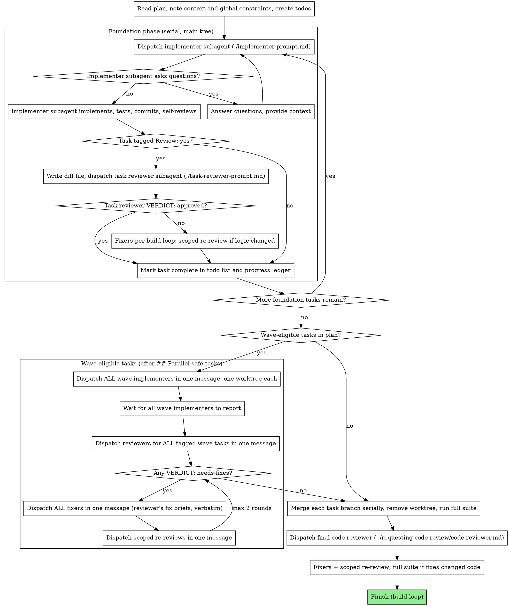

# Subagent-Driven Development

Execute a Large-tier plan: a fresh implementer subagent per task, a task review (spec compliance + code quality) after each task tagged `Review: yes`, and a whole-branch review at the end. Tests, reviews, and fixes follow the build loop: `../using-superpowers-fast/references/build-loop.md`.

**Why subagents:** You delegate tasks to specialized agents with isolated context. By precisely crafting their instructions and context, you ensure they stay focused and succeed at their task. They should never inherit your session's context or history — you construct exactly what they need. This also preserves your own context for coordination work.

**Core principle:** Fresh subagent per task + review where risk warrants it + broad final review = high quality, fast iteration

**Narration:** between tool calls, narrate at most one short line — the
ledger and the tool results carry the record.

**Continuous execution:** Do not pause to check in with your human partner between tasks. Execute all tasks from the plan without stopping. The only reasons to stop are: BLOCKED status you cannot resolve, ambiguity that genuinely prevents progress, or all tasks complete. "Should I continue?" prompts and progress summaries waste their time — they asked you to execute the plan, so execute it.

## When to Use

Large-tier plans written by `writing-plans`. Medium specs use `lean-build`; Simple changes use `quick-change`.

## The Process



## Execution Model: Foundation, then Waves

Plans written with the writing-plans skill mark a `## Parallel-safe tasks`
boundary. Everything before it is **foundation**; everything after it is
**wave-eligible**.

**Foundation phase (serial):** execute each foundation task: dispatch
implementer → task review if tagged `Review: yes` → fixes and scoped re-review
per the build loop. Foundation tasks run in the main working tree.

**Implement wave:** dispatch the ENTIRE wave-eligible set concurrently in a
single message — every task after the `## Parallel-safe tasks` boundary goes in
one wave, not a subset. A parallel-safe task depends only on foundation tasks
(never on a sibling), so there is never a reason to hold one back or run it
solo; if a task truly must follow another wave task, it was mis-classified and
belongs in the foundation phase. Do not let a heavier task, or a hedged
`Depends on:` line that name-drops a foundation task as "…merged, for
end-to-end," peel a task out of the wave — batch the whole set.

Before dispatching, create the worktrees as an explicit step you must
complete and verify — not a principle to keep in mind:

1. For EACH wave task, create one dedicated worktree branched from the last
   foundation commit, per Worktrees in the build loop. Give each a distinct
   name (e.g. `<feature>-task<N>`), one per task.
2. Confirm you now have N distinct worktree paths for N wave tasks before
   dispatching anything. If two tasks would share a path, STOP and fix it.
3. Each implementer's dispatch names its own worktree path as its exclusive
   workspace.

Never dispatch two wave implementers into the same worktree. The hazard is NOT
file overlap — it is that two agents committing in one working tree race on the
shared git index and HEAD: one can stage the other's half-written files, or
their commits interleave and clobber each other. Disjoint files do not make a
shared worktree safe; "their files don't overlap, so one tree is fine" is the
exact rationalization that corrupts a wave. One worktree per task, always.

**Review wave:** as each task tagged `Review: yes` reports DONE, generate its
review package in its worktree (scripts/review-package BASE HEAD there). When
the implement wave has fully returned, dispatch ALL pending task reviewers in
ONE message — reviewers are read-only, so N reviewers across N worktrees cannot
conflict. Untagged tasks go straight to the merge phase.

**Fix wave:** collect verdicts. For every task whose reviewer returned
`VERDICT: needs-fixes`, dispatch ALL standard-tier fixers in one message — each
in its task's worktree, each carrying its reviewer's standard-tier fix brief
verbatim — then ALL cheap-tier fixers with the cheap-tier briefs. Then dispatch
scoped re-reviews (fix diffs that touched logic) in one message. At most two
rounds; then surface what's left to your human partner.

**Merge phase (serial — deliberately):** merge each task branch into the
feature branch one at a time, resolving conflicts as they surface; remove each
task worktree after its merge; run the full suite (the build loop's merge
gate); then run the outer loop: final whole-branch review (most capable tier),
fixers, scoped re-review, full suite if fixes changed code, Finish.

**Degenerate cases:** plans with no `## Parallel-safe tasks` section,
single-task plans, and wave tasks whose `Depends on:` lines chain on each other
all run the classic serial loop. When in doubt about a dependency, serialize
that task into the foundation phase — correctness beats parallelism.

**Ledger:** record wave events, not just task events: `Wave N dispatched
(tasks 4,5,6)`, `Task 5: approved (wave N, commits a1b2c3..d4e5f6)`,
`Wave N complete`. After compaction, the ledger plus `git branch --list`
recovers which task branches exist and their review states.

## Pre-Flight Plan Review

Before dispatching Task 1, scan the plan once for conflicts:

- tasks that contradict each other or the plan's Global Constraints
- anything the plan explicitly mandates that the review rubric treats as a
  defect (a test that asserts nothing, verbatim duplication of a logic block)

Present everything you find to your human partner as one batched question —
each finding beside the plan text that mandates it, asking which governs —
before execution begins, not one interrupt per discovery mid-plan. If the
scan is clean, proceed without comment. The review loop remains the net for
conflicts that only emerge from implementation. Then run the build loop's
pre-flight (fetch, overlap check, baseline).

## Model Selection

Use the least powerful model that can handle each role to conserve cost and increase speed.

**Mechanical implementation tasks** (isolated functions, clear specs, 1-2 files): use a fast, cheap model. Most implementation tasks are mechanical when the plan is well-specified.

**Integration and judgment tasks** (multi-file coordination, pattern matching, debugging): use a standard model.

**Architecture and design tasks**: use the most capable available model.
The final whole-branch review is one of these — dispatch it on the most
capable available model, not the session default.

**Review tasks**: choose the model with the same judgment, scaled to the
diff's size, complexity, and risk. A small mechanical diff does not need the
most capable model; a subtle concurrency change does.

**Always specify the model explicitly when dispatching a subagent.** An
omitted model inherits your session's model — often the most capable and
most expensive — which silently defeats this section.

**Turn count beats token price.** Wall-clock and context cost scale with how
many turns a subagent takes, and the cheapest models routinely take 2-3× the
turns on multi-step work — costing more overall. Use a mid-tier model as the
floor for reviewers and for implementers working from prose descriptions.
When the task's plan text contains the complete code to write, the
implementation is transcription plus testing: use the cheapest tier for
that implementer. Single-file mechanical fixes also take the cheapest tier.

**Task complexity signals (implementation tasks):**
- Touches 1-2 files with a complete spec → cheap model
- Touches multiple files with integration concerns → standard model
- Requires design judgment or broad codebase understanding → most capable model

## Handling Implementer Status

Implementer subagents report one of four statuses. Handle each appropriately:

**DONE:** For a task tagged `Review: yes`, generate the review package (`scripts/review-package BASE HEAD`, from this skill's directory — it prints the unique file path it wrote; BASE is the commit you recorded before dispatching the implementer — never `HEAD~1`, which silently drops all but the last commit of a multi-commit task), then dispatch the task reviewer with the printed path. Untagged tasks are complete.

**DONE_WITH_CONCERNS:** The implementer completed the work but flagged doubts. Read the concerns before proceeding. If the concerns are about correctness or scope, address them before moving on. If they're observations (e.g., "this file is getting large"), note them and proceed.

**NEEDS_CONTEXT:** The implementer needs information that wasn't provided. Provide the missing context and re-dispatch.

**BLOCKED:** The implementer cannot complete the task. Assess the blocker:
1. If it's a context problem, provide more context and re-dispatch with the same model
2. If the task requires more reasoning, re-dispatch with a more capable model
3. If the task is too large, break it into smaller pieces
4. If the plan itself is wrong, escalate to the human

**Never** ignore an escalation or force the same model to retry without changes. If the implementer said it's stuck, something needs to change.

## Handling Reviewer ⚠️ Items

The task reviewer may report "⚠️ Cannot verify from diff" items — requirements
that live in unchanged code or span tasks. These do not block the rest of the
review, but you must resolve each one yourself before marking the task
complete: you hold the plan and cross-task context the reviewer
lacks. If you confirm an item is a real gap, treat it as a failed spec
review — dispatch a standard-tier fixer, then a scoped re-review.

## Constructing Reviewer Prompts

Per-task reviews are task-scoped gates. The broad review happens once, at the
final whole-branch review. When you fill a reviewer template:

- Do not add open-ended directives like "check all uses" or "run race tests
  if useful" without a concrete, task-specific reason
- Do not ask a reviewer to re-run tests the implementer already ran on the
  same code — the implementer's report carries the test evidence
- Do not pre-judge findings for the reviewer — never instruct a reviewer to
  ignore or not flag a specific issue. If you believe a finding would be a
  false positive, let the reviewer raise it and adjudicate it in the review
  loop. If the prompt you are writing contains "do not flag," "don't treat X
  as a defect," "at most Minor," or "the plan chose" — stop: you are
  pre-judging, usually to spare yourself a review loop.
- The global-constraints block you hand the reviewer is its attention
  lens. Copy the binding requirements verbatim from the plan's Global
  Constraints section or the spec: exact values, exact formats, and the
  stated relationships between components ("same layout as X", "matches
  Y"). The reviewer's template already carries the process rules (YAGNI,
  test hygiene, review method) — the constraints block is for what THIS
  project's spec demands.
- Hand the reviewer its diff as a file: run this skill's
  `scripts/review-package BASE HEAD` and pass the reviewer the file path
  it prints (or, without bash: `git log --oneline`, `git diff --stat`,
  and `git diff -U10` for the range, redirected to one uniquely named
  file). The output never enters your own context, and the reviewer sees
  the commit list, stat summary, and full diff with context in one Read
  call. Use the BASE you recorded before dispatching the implementer —
  never `HEAD~1`, which silently truncates multi-commit tasks.
- A dispatch prompt describes one task, not the session's history. Do not
  paste accumulated prior-task summaries ("state after Tasks 1-3") into
  later dispatches — a real session's dispatch hit 42k chars of which 99%
  was pasted history. A fresh subagent needs its task, the interfaces it
  touches, and the global constraints. Nothing else.
- Critical and Important findings go to one standard-tier fixer (the
  reviewer's standard-tier brief); Minor findings then go to one cheap-tier
  fixer (the cheap-tier brief). Re-review only fix diffs that touched logic.
- A finding labeled plan-mandated — or any finding that conflicts with
  what the plan's text requires — is the human's decision, like any plan
  contradiction: present the finding and the plan text, ask which governs.
  Do not dismiss the finding because the plan mandates it, and do not
  dispatch a fix that contradicts the plan without asking.
- The final whole-branch review gets a package too: run
  `scripts/review-package MERGE_BASE HEAD` (MERGE_BASE = the commit the
  branch started from, e.g. `git merge-base main HEAD`) and include the
  printed path in the final review dispatch, so the final reviewer reads
  one file instead of re-deriving the branch diff with git commands.
- Every fix dispatch carries the implementer contract: the fix subagent
  re-runs the tests covering its change and reports the results. Name the
  covering test files in the dispatch — a one-line fix does not need the
  whole suite. Before re-dispatching the reviewer, confirm the fix report
  contains the covering tests, the command run, and the output; dispatch
  the scoped re-review (fixes that touched logic) once all three are present.
- If the final whole-branch review returns findings, dispatch ONE
  standard-tier fixer with the complete Critical/Important list, then ONE
  cheap-tier fixer with the Minor list — never one fixer per finding.
  Per-finding fixers each rebuild context and re-run suites; a real
  session's final-review fix wave cost more than all its tasks combined.

## File Handoffs

Everything you paste into a dispatch prompt — and everything a subagent
prints back — stays resident in your context for the rest of the session
and is re-read on every later turn. Hand artifacts over as files:

- **Task brief:** before dispatching an implementer, run this skill's
  `scripts/task-brief PLAN_FILE N` — it extracts the task's full text to a
  uniquely named file and prints the path. Compose the dispatch so the
  brief stays the single source of requirements. Your dispatch should
  contain: (1) one line on where this task fits in the project; (2) the
  brief path, introduced as "read this first — it is your requirements,
  with the exact values to use verbatim"; (3) interfaces and decisions
  from earlier tasks that the brief cannot know; (4) your resolution of
  any ambiguity you noticed in the brief; (5) the report-file path and
  report contract. Exact values (numbers, magic strings, signatures, test
  cases) appear only in the brief.
- **Report file:** name the implementer's report file after the brief
  (brief `…/task-N-brief.md` → report `…/task-N-report.md`) and put it in
  the dispatch prompt. The implementer writes the full report there and
  returns only status, commits, a one-line test summary, and concerns.
- **Reviewer inputs:** the task reviewer gets three paths — the same brief
  file, the report file, and the review package — plus the global
  constraints that bind the task.
- Fix dispatches append their fix report (with test results) to the same
  report file and return a short summary; re-reviews read the updated file.

## Durable Progress

Conversation memory does not survive compaction. In real sessions,
controllers that lost their place have re-dispatched entire completed task
sequences — the single most expensive failure observed. Track progress in
a ledger file, not only in todos.

- At skill start, check for a ledger:
  `cat "$(git rev-parse --show-toplevel)/.superpowers/sdd/progress.md"`. Tasks listed there
  as complete are DONE — do not re-dispatch them; resume at the first task
  not marked complete.
- When a task completes (review clean, or untagged and DONE), append one
  line to the ledger in the same message as your other bookkeeping:
  `Task N: complete (commits <base7>..<head7>, review clean|untagged)`.
- The ledger is your recovery map: the commits it names exist in git even
  when your context no longer remembers creating them. After compaction,
  trust the ledger and `git log` over your own recollection.
- `git clean -fdx` will destroy the ledger (it's git-ignored scratch); if
  that happens, recover from `git log`.

## Prompt Templates

- [implementer-prompt.md](implementer-prompt.md) - Dispatch implementer subagent
- [task-reviewer-prompt.md](task-reviewer-prompt.md) - Dispatch task reviewer subagent (spec compliance + code quality)
- Final whole-branch review: [code-reviewer.md](../requesting-code-review/code-reviewer.md), with `[DIFF_FILE]` from `scripts/review-package MERGE_BASE HEAD`

## Example Workflow

```
You: I'm using Subagent-Driven Development to execute this plan.

[Read plan file once: docs/superpowers/plans/feature-plan.md]
[Create todos for all tasks; run the build loop's pre-flight]

Task 1: Hook installation script (Review: no)

[Run task-brief for Task 1; dispatch implementer with brief + report paths + context]

Implementer: "Before I begin - should the hook be installed at user or system level?"

You: "User level (~/.config/superpowers/hooks/)"

Implementer:
  - Implemented install-hook command
  - Added tests, 5/5 passing (targeted)
  - Self-review: Found I missed --force flag, added it
  - Committed

[Untagged → mark Task 1 complete]

Task 2: Recovery modes (Review: yes — state machine)

[Run task-brief for Task 2; dispatch implementer]

Implementer: Added verify/repair modes; 8/8 targeted tests passing; committed

[Run review-package, dispatch task reviewer with the printed path]
Task reviewer: Spec ❌ — missing progress reporting ("every 100 items"); extra --json flag.
  Minor: magic number (100).
  VERDICT: needs-fixes — standard-tier brief (spec gaps), cheap-tier brief (magic number)

[Dispatch the standard-tier fixer, then the cheap-tier fixer — briefs verbatim]
Fixers: removed --json, added progress reporting; extracted PROGRESS_INTERVAL

[The fix touched logic → scoped re-review of the fix commits]
Task reviewer: VERDICT: approved

[Mark Task 2 complete]

...

[After all tasks: full suite (merge gate) → final code reviewer → fixers and scoped re-review if needed → Finish]
```

## Advantages

**vs. Manual execution:**
- Subagents follow TDD naturally
- Fresh context per task (no confusion)
- Parallel-safe (subagents don't interfere)
- Subagent can ask questions (before AND during work)

**Efficiency gains:**
- Controller curates exactly what context is needed; bulk artifacts move
  as files, not pasted text
- Subagent gets complete information upfront
- Questions surfaced before work begins (not after)

**Quality gates:**
- Self-review catches issues before handoff
- Task review carries two verdicts: spec compliance and code quality
- Review loops ensure fixes actually work
- Spec compliance prevents over/under-building
- Code quality ensures implementation is well-built

**Cost:**
- More subagent invocations (implementer + reviewer per task)
- Controller does more prep work (extracting all tasks upfront)
- Review loops add iterations
- But catches issues early (cheaper than debugging later)

## Red Flags

**Never:**
- Start implementation on main/master branch without explicit user consent
- Skip review on a task tagged `Review: yes`, or accept a report missing either verdict (spec compliance AND task quality are both required)
- Proceed with unfixed issues
- Share one worktree across two wave implementers (dispatch them together, yes — but into DIFFERENT worktrees; two agents in one tree race on the shared git index/HEAD regardless of which files they touch — disjoint files are NOT an exception; create one worktree per task and verify N paths for N tasks before dispatching)
- Run one parallel-safe task solo or hold it back from the wave (the whole set after the boundary goes in one dispatch; a task that can't is mis-classified foundation, not a wave straggler)
- Dispatch reviewers one at a time when multiple tasks await review (reviews are read-only — always batch the wave)
- Author a fix dispatch yourself when the reviewer's fix brief exists — route the brief verbatim (plus worktree path); controller-authored fix prompts are the top source of orchestration overhead
- Make a subagent read the whole plan file (hand it its task brief —
  `scripts/task-brief` — instead)
- Skip scene-setting context (subagent needs to understand where task fits)
- Ignore subagent questions (answer before letting them proceed)
- Accept "close enough" on spec compliance (reviewer found spec issues = not done)
- Skip the scoped re-review after a fix that touched logic
- Let implementer self-review replace actual review (both are needed)
- Tell a reviewer what not to flag, or pre-rate a finding's severity in the
  dispatch prompt ("treat it as Minor at most") — the plan's example code is
  a starting point, not evidence that its weaknesses were chosen
- Dispatch a task reviewer without a diff file — generate it first
  (`scripts/review-package BASE HEAD`) and name the printed path in the
  prompt
- Move to next task while the review has open Critical/Important issues
- Re-dispatch a task the progress ledger already marks complete — check
  the ledger (and `git log`) after any compaction or resume

**If subagent asks questions:**
- Answer clearly and completely
- Provide additional context if needed
- Don't rush them into implementation

**If reviewer finds issues:**
- Standard-tier fixer for Critical/Important, then cheap-tier fixer for Minor
- Scoped re-review when a fix touched logic
- At most two rounds, then surface what's left to your human partner

**If subagent fails task:**
- Dispatch fix subagent with specific instructions
- Don't try to fix manually (context pollution)

## Integration

- **superpowers-fast:writing-plans** — creates the plan this skill executes
- **Build loop** (`../using-superpowers-fast/references/build-loop.md`) — pre-flight, tests, review and fix rules, worktrees, Finish
- **superpowers-fast:requesting-code-review** — template for the final whole-branch review
- **superpowers-fast:test-driven-development** — implementers follow TDD for each task
